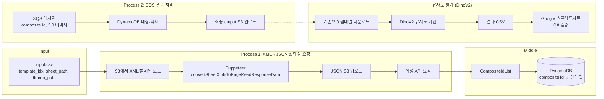
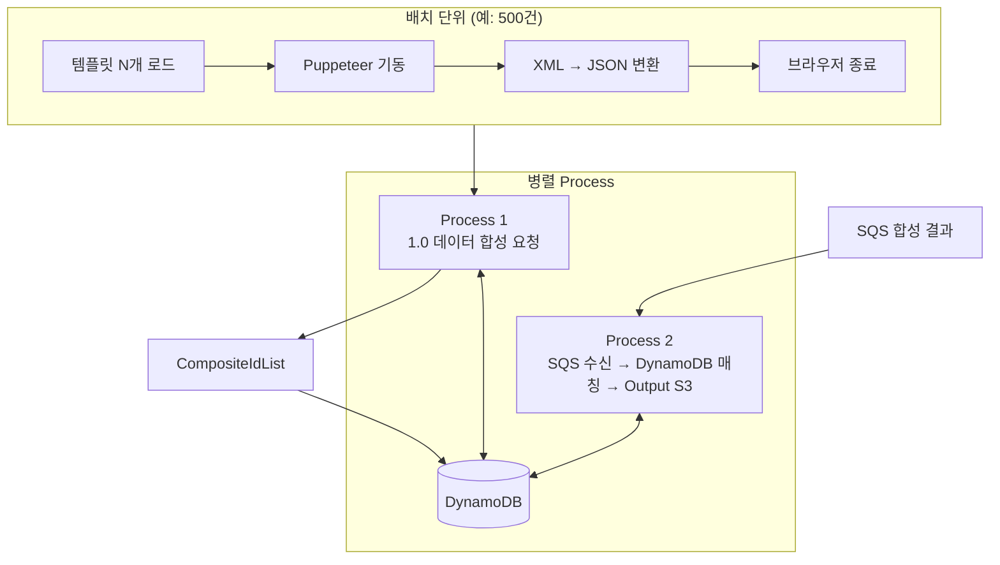
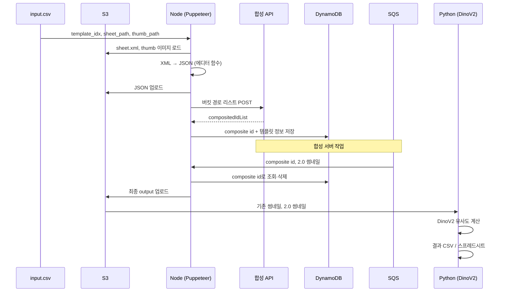

# 이미지 유사도 정합성 평가 및 배치 개발 내역

> **목적**: 디자인 1.0 → 2.0 변환 후 생성된 썸네일과 기존 썸네일 간 **이미지 유사도 정합성 평가** 파이프라인 구축 및 여러 배치 운영 개발  
> **출처**: Jira AI-502·AI-527·AI-543, Confluence AIDMLOps (정합성 배치 프로세스, 2.0 Json 배치)

---

## 1. 개요

| 구분 | 내용 |
|------|------|
| **에픽** | AI-204 AI 데이터 체계 구축 |
| **스토리** | [AI-502] 이미지 유사도 비교 프로세스 개발 |
| **하위 작업** | AI-515(이미지 유사도 결과값 추출), AI-527(합성 API 변경·json S3 업로드), AI-543(배치·병렬처리) |
| **기간** | 2024-11 ~ 2025-02 (Sprint 723~804) |
| **주요 기술** | Node.js, Puppeteer, DinoV2, S3, SQS, DynamoDB, 합성 API, Google Spreadsheet |

정합성 평가 목표(회의록 기준): **주 1회 → 주 2회** 템플릿 약 18만 건 처리, 유사도 자동화 포함.

---

## 2. Jira 티켓별 개발 내역

### 2.1. [AI-502] 이미지 유사도 비교 프로세스 개발 (스토리)

**요약**: 1.0 템플릿 데이터를 2.0으로 변환·합성한 뒤, 기존 썸네일과 2.0 썸네일을 **DinoV2로 유사도 비교**하고 결과를 CSV·스프레드시트로 정리하는 end-to-end 프로세스 설계·개발.

**프로세스 (티켓 설명 기준)**

1. **입력 준비**  
   - 대상 템플릿 정보 파일 수신: `template_idx`, 템플릿 sheet 버킷 경로, 기존 템플릿 썸네일 버킷 경로 (Node 개발).
2. **디자인 2.0 컨버터**  
   - 담당자(임학수) 컨버터 코드 수령 후, XML → JSON 변환 자동화 검토.
3. **합성 API**  
   - 변환된 JSON을 합성 API에 전달해 이미지 생성 요청 (API 스펙 확정 후 연동).
4. **SQS 구독·소비**  
   - 지정 큐 구독 후, 2.0 합성 썸네일 버킷 경로 등 메시지 소비.
5. **비교 대상 이미지 다운로드**  
   - 기존 썸네일·2.0 썸네일 다운로드.
6. **유사도 비교**  
   - **Python DinoV2**로 이미지 유사도 계산 → output: DinoV2 유사도.
7. **결과 산출**  
   - CSV 생성: `template_idx`, `template_page_idx`(0부터), 기존 썸네일 URL, 2.0 썸네일 URL, 유사도, 통과 여부(PASS/FALSE).  
   - 신규 Google 스프레드시트에 CSV import → QA 검증용.

**관련 서브태스크**: AI-515(유사도 결과값 추출), AI-527(json S3 업로드), AI-543(배치·병렬처리).

---

### 2.2. [AI-527] 합성 API 변경으로 json S3 업로드 로직 개발

**요약**: 합성 API 스펙 변경에 맞춰, miriconverter(xml→json) 결과를 포맷팅한 뒤 **ailabs S3에 JSON 업로드**하고, 해당 경로 리스트를 합성 API에 POST해 `compositedIdList`를 받는 흐름 구현.

**프로세스**

1. miriconverter로 받은 JSON 데이터 포맷팅.
2. **ailabs S3 버킷**에 `.json` 파일 업로드 (파일명은 `input.csv` 순서 기준 넘버링).
3. 버킷 이름·경로 리스트를 합성 API에 POST.
4. 응답으로 **compositedIdList** 수신.

**참고 코드**: [ailabs-similarity-score commit 747b72c](https://github.com/miridih/ailabs-similarity-score/commit/747b72c793b1612c99ce8f65837b3105175b0c37)

---

### 2.3. [AI-543] 배치 및 병렬처리 개발

**요약**: 퍼피티어(브라우저) 리소스 과다 적재 시 protocol timeout 방지를 위해 **배치 단위로 브라우저 재시작**하고, **노드 프로세스 2개**로 1.0→2.0 변환·합성 요청과 SQS 결과 처리·최종 output 생성을 분리해 병렬 처리.

**배치**

- 퍼피티어로 템플릿 **500개** 단위로 XML→JSON 컨버팅 후 브라우저 종료해 리소스 초기화.  
- 관련 코드: [ailabs-similarity-score src/app.ts](https://github.com/miridih/ailabs-similarity-score/blob/main/src/app.ts)

**병렬 구조**

| 구분 | 역할 | 입·출력 |
|------|------|---------|
| **Process 1** | 1.0 이미지 데이터(xml) 합성 요청 | Input: CSV(`template_idx`, `sheet_file_path`, `thumb_file_path`) → S3 이미지/XML 로드 → 퍼피티어 XML→JSON → JSON S3 저장 → 합성 API 요청 → **CompositeIdList** |
| **DynamoDB** | composite id ↔ 템플릿 매칭 저장 | 합성 요청 응답 composite id + 템플릿 정보 적재 |
| **Process 2** | SQS 응답 처리 및 최종 Output | SQS 메시지(composite id, 2.0 합성 이미지) → DynamoDB 매칭·조회 후 삭제 → 최종 output S3 업로드 |

**Process 1 상세**

- `thumb_file_path`: S3에서 이미지 다운로드 후 string 등으로 보관.
- `sheet_file_path`: 1.0 sheet.xml을 xml_string으로 저장.
- 퍼피티어 실행 후 에디터에서 `window.convertSheetXmlsToPageReadResponseData` 호출 → 2.0 JSON 변환.
- 변환 JSON을 S3에 저장하고, 해당 버킷 경로를 합성 API와 함께 전송.

**Process 2 상세**

- SQS에서 composite id, 2.0 합성 이미지 데이터 수신.
- composite id로 DynamoDB에서 매칭 item 조회 후 삭제.
- 최종 결과를 S3에 업로드.

---

## 3. Confluence 문서 요약

### 3.1. 탬플릿 2.0 Json 파일 저장 배치 (2.0 Json)

- **목적**: Xml→Json 컨버터로 만든 JSON을 DB 저장용 API에 넘기기 위한 배치. 브라우저가 필요해 퍼피티어로 컨버팅 후 API 요청.
- **프로세스**: 15만 장 템플릿을 1,000개씩 배치 → dinov2 유사도·육안검사 결과와 매칭해 POST body 생성 → s3 경로, template_idx, template_page_idx, 유사도, 육안검사 결과를 body에 담아 2.0 json API 호출.

### 3.2. [3차] 정합성 배치 프로세스 분리 아키텍처 - DynamoDB

- Process 1: CSV 입력 → S3(xml/thumb) → 퍼피티어 XML→JSON → JSON S3 → 합성 API → CompositeIdList.
- DynamoDB: composite id와 템플릿 매칭 적재.
- Process 2: SQS(composite id, 2.0 이미지) → DynamoDB 매칭·삭제 → output S3 업로드.

(원문에는 아키텍처 이미지가 포함되어 있음.)

### 3.3. 템플릿 정합성 배치 프로세스 회의록

- 목표: 주 1회 → 주 2회 18만 건 처리, 유사도 자동화, 소요 시간·스펙업·EC2 현황 파악.
- Node 배치·자동화: S3 input CSV 다운 → xml to json 컨버터 + API 호출(요청 9MB 제한) → SQS 결과 수신·에러 로그(template idx, page num, error message) → output.csv S3 업로드 후 업로드 완료 알림 → EC2 배포·CI/CD.

---

## 4. 워크플로우 도식화

아래는 Confluence의 **정합성 배치 프로세스 분리 아키텍처**와 Jira AI-502·AI-527·AI-543 내용을 합쳐 정리한 전체 워크플로우다.

### 4.1. 전체 정합성 평가 파이프라인 (High-level)

### 4.2. 배치·병렬처리 구조 (AI-543)

### 4.3. 데이터 흐름 (단일 템플릿 기준)

---

## 5. 산출물·참고 링크

| 구분 | 링크 |
|------|------|
| Jira 스토리 | [AI-502 이미지 유사도 비교 프로세스 개발](https://miridih.atlassian.net/browse/AI-502) |
| Jira 하위작업 | [AI-527](https://miridih.atlassian.net/browse/AI-527) json S3 업로드, [AI-543](https://miridih.atlassian.net/browse/AI-543) 배치·병렬처리, [AI-515](https://miridih.atlassian.net/browse/AI-515) 유사도 결과값 추출 |
| Confluence | AIDMLOps 스페이스 — [2.0 Json](https://miridih.atlassian.net/wiki/spaces/AIDMLOps/pages/758317176), [3차 정합성 배치 아키텍처 - DynamoDB](https://miridih.atlassian.net/wiki/spaces/AIDMLOps/pages/791283807), [템플릿 정합성 배치 프로세스 회의록](https://miridih.atlassian.net/wiki/spaces/AIDMLOps/pages/725061834) |
| 코드 | [ailabs-similarity-score](https://github.com/miridih/ailabs-similarity-score) (app.ts, json S3 업로드 등) |

---

## 6. 요약

- **이미지 유사도 정합성 평가**: 1.0 템플릿을 2.0 JSON으로 변환·합성한 뒤, 기존 썸네일과 2.0 썸네일을 **DinoV2**로 비교해 유사도·통과 여부를 CSV·스프레드시트로 산출하는 파이프라인을 설계·구현.
- **배치**: 퍼피티어 리소스 관리를 위해 **500건 단위** XML→JSON 후 브라우저 재시작.
- **병렬처리**: **Process 1**(합성 요청·CompositeId 수신)과 **Process 2**(SQS 수신·DynamoDB 매칭·output S3)를 분리하고, **DynamoDB**로 composite id–템플릿 매칭을 유지.
- **합성 API 대응**: JSON을 **ailabs S3**에 업로드하고 경로 리스트를 POST해 compositedIdList를 받는 흐름(AI-527)으로 API 변경에 대응.

이 문서는 위 Jira·Confluence 내용을 바탕으로 개발 내역과 워크플로우를 정리한 것이다.
