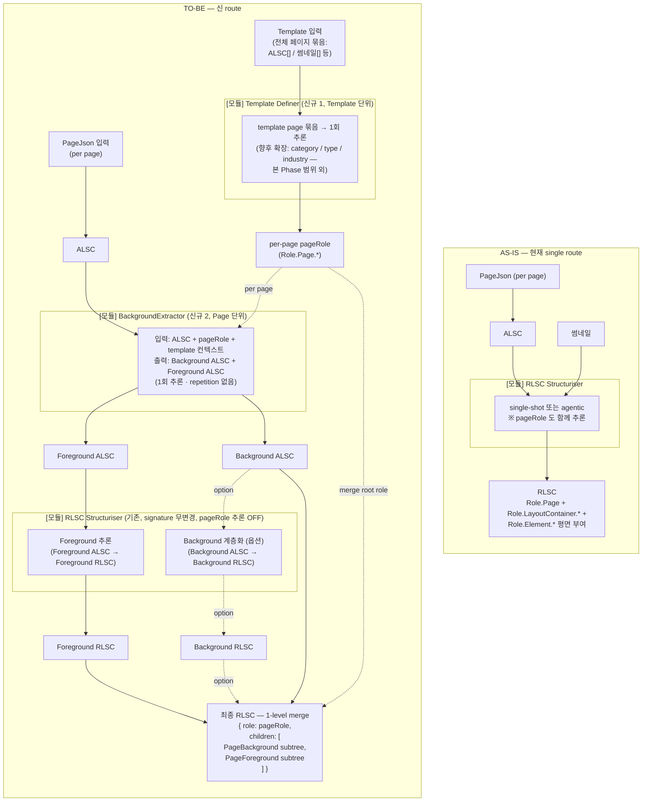
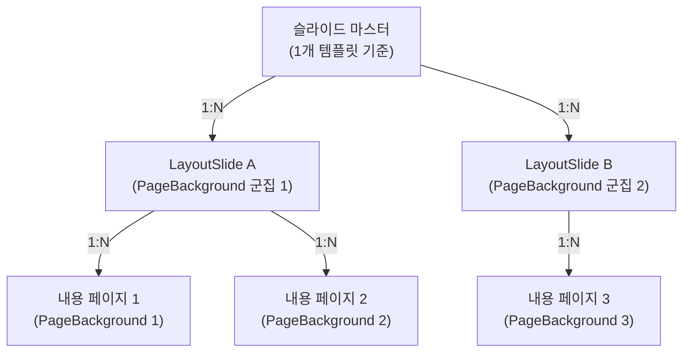
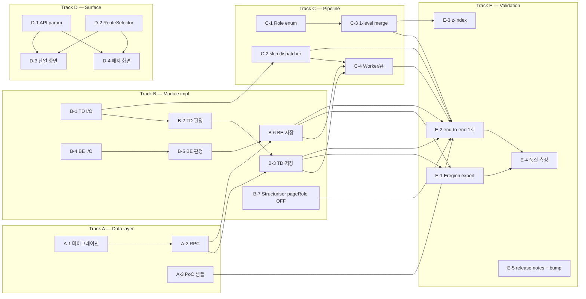

# RLSC 배경 전처리·슬라이드 마스터 Blueprint

이 문서는 **미캔 템플릿에서 "배경(공통) vs 바디(콘텐츠)"를 RLSC 본 추론 전에 정리**하려는 제품·기술 합의를 한 곳에 모아두기 위한 **repo SSoT(Single Source of Truth)** 다. AI Agent가 빠르게 읽고 정확한 diff로 편집할 수 있도록, Jira·Confluence는 이 문서의 실행/공유용 참조로 둔다.

회의 **운영 정보**(왜/언제/누구)는 [`rlsc-enhancement-meeting.md`](./rlsc-enhancement-meeting.md)에서 관리한다.

## 0. 이 문서가 답하는 것

- **무엇을 새로 만들려는가**: 기존 `PageJson → ALSC → RLSC` 파이프라인을 **3 모듈**로 명시 분리한다.
  1. **`Template Definer` (신규, Template 단위)** — template 의 page 묶음을 입력으로 받아 **page 마다 `Role.Page` 를 결정**한다. 이번 범위는 `pageRole` 까지지만, 이후 template-level 메타(rhetorical category / type / industry 등) 확장의 자리(placeholder)로 함께 둔다. 결과는 `rlsc_results` 처럼 **1:N 저장**(같은 template 에 여러 추출 결과 누적 가능).
  2. **`BackgroundExtractor` (신규, Page 단위)** — 한 페이지의 ALSC + Template Definer 가 결정한 `pageRole` + template 컨텍스트를 받아, **Background ALSC + Foreground ALSC** 로 가른다. 1회 추론.
  3. **`RLSC Structuriser` (기존, signature 무변경)** — Foreground ALSC(또는 옵션으로 Background ALSC)를 입력으로 받아 RLSC with Role 을 만든다. **신 route 에서는 `pageRole` 을 더 이상 추론하지 않는다**.
  > **참고 — `Role.Page` 판정 위치 변경**: 현재 `Role.Page`는 5종(`Opening / Agenda / SectionDivider / Content / Ending`)이며, **`ToolCallingRLSCStructuriser` 내부 `assign_roles` 툴 호출**에서 결정된다(`ToolCallingRLSCStructuriser.ts:298`). 이번 Phase 에서 `Template Definer` 로 옮기며, **신 route 의 RLSC Structuriser 는 `pageRole` 을 추론하지 않는다**(2026-04-28 결정 + 2026-04-29 후속 정리, §4). 기존 route 는 그대로 유지한다.
- **왜 지금 필요한가**: RLSC가 모든 요소를 한 번에 해석할 때 생기는 **배경·꾸밈·본문 간 혼선**을 줄이고, 내용시각화/AIP·스타일대치·검색에서 공통으로 활용할 **배경 메타**를 확보하기 위해서다.
- **여기서 결정하지 않는 것**: 최종 제품 네이밍, 엔진 내부 타입 정의 변경, 미캔 BE 전달 포맷 변경, 조직별 R&R 상세는 **Confluence/Slack/Jira 정본**을 따른다.

## 1. 왜 필요한가

- **핵심 목적**: 배경 요소를 먼저 잘라낸 뒤 RLSC를 실행해, **컴포넌트(바디) 추출 정확도**를 높이는 것이다. 지금은 배경·꾸밈·본문 요소가 한꺼번에 RLSC에 들어가기 때문에, 모델이 "무엇이 의미 있는 컴포넌트인가"를 판단하는 데 노이즈가 많다.
- **부수 효과(기대)**: 배경 메타가 생기면 AIP/스타일대치·페이지검색 같은 **다운스트림**에서도 활용할 수 있다. 이 가설은 [RLSC 고도화 회의록](https://miridih.atlassian.net/wiki/spaces/TM/pages/2435646057/RLSC)과 [202604 RLSC 오류 유형 검토](https://miridih.atlassian.net/wiki/spaces/TM/pages/2410316804)에서 반복적으로 정리됐다.

> **현재 방향 — 배경 완전 제거**
>
> 현재 지향점은 **배경을 RLSC Structuriser의 입력에서 완전히 제외**하고, RLSC Structuriser가 배경 없는 바디 중심 입력으로 실행되는 것이다. 단, 아래 사이드 이펙트가 실제로 발생하는지 **PoC + human labeler 샘플 검수**로 먼저 확인해야 한다.
>
> - **컨텍스트 손실**: RLSC Structuriser가 배경 요소를 보고 전경 요소의 역할을 추론하는 데 참고하고 있다면, 제외 후 그 맥락이 사라진다. PoC에서 오분류 패턴으로 드러날 것.
> - **오분류로 인한 콘텐츠 누락**: 전처리에서 배경으로 잘못 분류된 바디 요소는 RLSC Structuriser에 전달되지 않는다. 린터와 달리 복구 지점이 없으므로, human labeler가 샘플 단위로 누락 케이스를 직접 확인해야 한다.
> - **학습 데이터 분포 변경**: 기존 라벨링 데이터는 배경 포함 상태로 만들어진 것이다. GPT 기반 Structuriser는 배경 제외 후 프롬프트가 여전히 올바르게 동작하는지 검토가 필요하고, 자체 모델은 학습 데이터 분포와 달라지므로 추출 결과가 정상적으로 나오는지 별도 검증이 필요하다.
>
> PoC 범위·검수 기준·버저닝 전략은 §4 미결정 쟁점 참조.

### 이 문서의 범위

| 포함 | 제외 |
|------|------|
| 페이지 단위 `Role.Page` 판정, 요소 단위 배경/바디 구분, 같은 배경 페이지를 레이아웃 슬라이드 후보로 묶는 방법 | 이 기능을 엔진 화면에서 어떻게 보여줄지, 미캔과 어떤 데이터 형식으로 주고받을지, 최종 이름을 무엇으로 할지는 여기서 정하지 않음 |
| MORDOR/aippt 레포 안에서 어디에 구현할지, 무엇을 재사용할지, 어떻게 검증할지 | 조직별 상세 담당 조정, 최종 Jira 일정표 작성 |
| 현재 파이프라인과 어떻게 연결할지 | `sheet → ALSC` 일반 오류를 전부 다시 조사하는 일 자체 |
| | **AIP 전용 속성** — 유효 바디 영역·네비게이션 Total Count·스타일 대치 속성 등, AIP·스타일대치에만 필요한 슬라이드 마스터 속성. RLSC 배경 전처리 목표(바디 집중)에는 해당하지 않음 |
| | **크로스체킹 린터** — 슬라이드 마스터 추출 ↔ RLSC 추출 교차 검증 린터. Confluence [2415591675](https://miridih.atlassian.net/wiki/spaces/TM/pages/2415591675)에서 RLSC 목표 중 하나로 언급되었으나, Phase 1 이후 별도 모듈로 분리 |

## 2. Confluence SSoT 맵

| 문서 | 용도 |
|------|------|
| [RLSC 고도화 회의록](https://miridih.atlassian.net/wiki/spaces/TM/pages/2435646057/RLSC) | 2026-04-07 / 14 / 21 **의사록** — 배경/포그라운드 리딩 담당, 이석·린터·subgroup, **진행 합의** |
| [RLSC 배경 전처리 (슬라이드 마스터)](https://miridih.atlassian.net/wiki/spaces/TM/pages/2415591675) | **슬라이드 마스터** 정의, 레이아웃 슬라이드·속성, RLSC/AIP/검색 **목표** |
| [페이즈 1 - 배경 전처리](https://miridih.atlassian.net/wiki/spaces/TM/pages/2459795479) | 2415591675 **1페이즈** 목표·입력값·**미결 논의**(결과 저장 위치, ALSC vs 전처리 ALSC, 룰 vs AI) |
| [슬라이드 마스터 네이밍](https://miridih.atlassian.net/wiki/spaces/TM/pages/2415591906) | **제품 명칭**(슬라이드 마스터 vs 대안) — 법/UX, 경쟁사 표 |
| [202604 RLSC 오류 유형 검토 - 1](https://miridih.atlassian.net/wiki/spaces/TM/pages/2410316804) | 4/7 **주간** 논의 — 마스터 전처리 vs subgroup, 이석 Bg/Deco |
| [RLSC 이전 단계 오류 의심 사례](https://miridih.atlassian.net/wiki/spaces/TM/pages/2433646732) | ALSC/Eregion vs 디자인 **3케이스**; [bbox 분석](https://miridih.atlassian.net/wiki/x/CAQ0kQ) 연계 |
| [RLSC 개념서](https://miridih.atlassian.net/wiki/spaces/TM/pages/2101641466) | `Full Sheet → ALSC → RLSC`, **Role.Page**·LayoutContainer/Element **용어** |
| (AIDMLOps) [서브그룹 이슈 후처리 로직](https://miridih.atlassian.net/wiki/spaces/AIDMLOps/pages/2415428544) | **Group/Stack/서브그룹** 후처리(회의록 4/21·스마트블록과 동축) |

**공용 스프레드시트** (속성·케이스): [17fRKejE... / gid=0](https://docs.google.com/spreadsheets/d/17fRKejEWRlxUdGH1mvMLVa8BU_FgiiDkUzy8L1uGGnk/edit#gid=0) — 2415591675·2459795479에서 반복 링크.

## 3. 파이프라인 관점 (의도)

아래 내용은 Confluence와 회의에서 논의된 흐름을, 현재 레포 기준으로 다시 정리한 것이다. 구현은 우선 **MORDOR·aippt 레포 안에서 닫히는 형태**로 잡고, 엔진 시트 형식이나 미캔 BE 전달 방식(S3/큐)까지 바뀌는 경우에만 별도 조율한다.

### 3-0. as-is ↔ to-be 한눈 비교



**핵심 차이** (위 두 subgraph 비교):

| 차이점 | AS-IS | TO-BE (신 route) |
|--------|-------|------------------|
| 모듈 구성 | RLSC Structuriser 1개 | **`Template Definer` (신설)** + **`BackgroundExtractor` (신설)** + RLSC Structuriser (기존) |
| 처리 단위 | Page 단위 1단계 | Template 단위(Template Definer) → Page 단위(BackgroundExtractor + Structuriser) 2단계 분리 |
| `pageRole` 결정 위치 | RLSC Structuriser 내부 (`assign_roles` 툴) | **`Template Definer` 가 결정** (template 전체를 보고 page 마다 부여). Structuriser·BackgroundExtractor 는 메타로 받음 |
| 비-content page 처리 | RLSC 추론 진행 (Structuriser 내부에서 결정됨) | **`Role.Page.Content` 가 아니면 BackgroundExtractor / Structuriser skip 후 종료** |
| 향후 template-level 메타 | (없음) | `Template Definer` 출력 자리만 둠 (category / type / industry 등은 본 Phase 범위 외) |
| ALSC 입력 갈래 (Structuriser 기준) | 1갈래 (페이지 ALSC 통째) | 2갈래 (Foreground ALSC 필수, Background ALSC 옵션) |
| Structuriser signature | 그대로 (`absoluteContent: ALSC + 썸네일`) | **그대로** (입력 형식 변경 없음) |
| 최종 RLSC 형식 | 트리 한 개 (Role 평면 부여) | 1-level depth 에 `PageBackground` / `PageForeground` 두 자식 노드 (신규 role 키) |
| 호출 횟수 | Page 당 1회 (단발) 또는 반복 (agentic) | Template 당 Template Definer 1회 + Content page 당 BackgroundExtractor 1회 + Structuriser 1~다회 |
| 결과 저장 | `rlsc_results` 1:N (page × N 결과) | **신규 전용 테이블 2개** (`template_definer_results` / `background_extractor_results`, 1:N 누적, status 검수 차원, 후속 모듈 입력은 `created_at DESC LIMIT 1`) + Structuriser 결과는 그대로 `rlsc_results` 1:N |
| 신·구 route 식별 | — | 별도 식별자 필드 없이 **신규 테이블 row 존재 여부**로 자연 식별. 호출 시점 선택은 UI + API 둘 다 |

각 단계의 상세 책임·I/O 는 §3-1(as-is) / §3-2(to-be) 표로 이어진다.

### 3-1. as-is — 현재 RLSC Structuriser 두 변형

레포에는 ALSC를 입력으로 받아 RLSC를 만드는 경로가 **두 가지**가 공존한다. **둘 다 입력은 ALSC** 이며, agentic 변형이 추가 메타를 더 받는다는 점만 다르다.

| 경로 | Entry | 입력 | 호출 횟수 | 비고 |
|------|-------|------|-----------|------|
| **단발 호출 (single-shot)** | `convertToRelativeLayoutViaFunctions(absoluteContent, relativeSnapshot?, thumbnailBase64?, templateId?, traceId?)` (`src/lib/absoluteToRelativeLayout/index.ts`) | ALSC + 썸네일 | LLM 1회 (layout functions) + role assignment 별도 | 레거시 경로. layout functions를 한 번에 받아 ALSC에 적용 |
| **Agentic (반복)** | `AgenticRLSCStructuriserManager.process()` → `RLSCGeneratorAgent` → `ToolCallingRLSCStructuriser.run(absoluteContent, thumbnailUrl, systemPrompt, onEvent, sheetData?: PageJson)` | ALSC + 썸네일 + (옵션) PageJson + trace 메타(`templateIdx`, `templatePageIdx`, `source`, `pageSheetJson`) | tool-calling 다회 + 4개 agent의 iterative refinement | 현 worker(`rlsc-worker.ts`) 표준 경로 |

핵심:
- **두 경로 모두 ALSC 1개를 입력**으로 받는다. RLSC를 입력으로 받는 경로는 없다.
- agentic 경로의 `pageRole` 결정은 RLSC 추론 도중 `assign_roles` 툴 호출 안에서 일어난다(`ToolCallingRLSCStructuriser.ts:298-300`).
- `rlsc_meta`에는 현재 `extractorVersion: getAppVersion()` 만 박힌다(`rlsc-worker.ts:377`). 모듈 단위 버전 키는 없다.

### 3-2. to-be — 모듈 분리 (3 모듈)

신 route 는 **Template 단위 1개 + Page 단위 2개** 의 모듈로 나눈다.

| 모듈 | 처리 단위 | 입력 | 출력 | 호출당 추론 | 결과 저장 |
|------|-----------|------|------|-------------|-----------|
| **`Template Definer` (신규 1)** | Template 1개 | **Phase 1 PoC 1차 — thumbnail 이미지 + pageIdx 만** (`Array<{ pageIdx, thumbnailUrl }>`. ALSC YAML / page index 시퀀스 외 추가 컨텍스트 미사용 — 본 코드에 반영. `src/lib/templateDefiner/types.ts` `TemplateDefinerPageInput`). 향후 ALSC 컨텍스트 / sibling page 메타 등은 옵션으로 확장할 자리만 둔다 | `{ perPagePageRole: Record<pageIdx, Role.Page.*>, results: Array<{ pageIdx, pageRole, reason? }>, model, rawResponse }` — `perPagePageRole` 은 다운스트림 메타 표준 형태, `results` 는 입력 순서를 보존한 디버깅·trace 용. 향후 template-level 메타(category / type / industry) 는 Phase 1 범위 외 | **논리적으로 template 당 1회 추론**(반복적 self-refinement 없음). 입력 길이 한계로 물리적 chunk 분할이 필요한 경우 chunk 별로 LLM 호출 후 application 단에서 결과를 merge — 이때도 추출 결과는 1 회차로 묶어 1 row 로 저장 (chunk 분할 정책은 Track B-1 backlog 에서 확정) | **신규 테이블 1:N 누적** (같은 template 에 추출 N 회 누적. status 는 검수 차원이며 후속 모듈 입력은 `created_at DESC LIMIT 1`. 가칭 `template_definer_results`) |
| **`BackgroundExtractor` (신규 2)** | **Template 1개 (target role page 묶음 batch)** — 한 template 의 target role page (default `Role.Page.Content`) 묶음을 한 번에 처리. **Per-page 처리 단계는 5 stage 로 구성 — (1) LLM 분류 → (2) `buildLayeredAlscFromIds` 로 ALSC 4-way partition → (3) `save_background_extractor_result` 로 4 alsc 컬럼 INSERT (단계적 채움 1차, MOR-1405) → (4) `buildBackgroundExtractorSheetJson` × 4 + `update_background_extractor_sheet_json` 으로 sheet_json 4 컬럼 동시 UPDATE (메모리의 originalPageJson + 4 ALSC 만 사용, DB 재조회 없음) → (5) `THUMBNAIL_GENERATOR_QUEUE` 에 4 버킷 썸네일 job dispatch (slidemaster / foreground / page_title / page_decoration — 별도 큐 신설 X — 기존 큐 + action 분기 재사용)** — DB 호출은 컨텍스트 적재 1회로 고정되고, LLM 호출만 target page 수만큼 N 회 (Phase 1 PoC 1차 + MOR-1405 4 카테고리 확장 코드 반영, `src/lib/backgroundExtractor/processBackgroundExtractor.ts`) | **Multi-image: full ALSC YAML + target page thumbnail (단독 블록) + 전체 template page thumbnails (target 포함, `template_page_idx` 오름차순)** + `templateIdx` + `perPagePageRole` (Template Definer 결과에서 주입) + `templateDefinerResultId`. ALSC 압축 없음. target 은 (1) `targetThumbnailUrl` 단독 블록과 (2) `templateThumbnails` 전체 흐름 안의 `(TARGET)` 라벨로 **양쪽 모두**에서 명시 — 같은 thumbnail array 1개를 batch 안에서 target page 마다 재사용. | LLM 응답은 **2축 직교 분류** (`Array<{ id, layer: 'slidemaster' \| 'foreground', element_role: 'pagetitle' \| 'pagedecoration' \| 'bodyframe' \| 'bodyframedecoration' \| null, confidence: { elementRole, layer } (3단계 `'low' \| 'medium' \| 'high'` self-report, MOR-1420), reason }>` — MOR-1405 갱신, PowerPoint Slide Master 개념 차용). 4 ALSC 버킷은 application 단 `buildLayeredAlscFromIds(alsc, classifications)` 가 `(layer, elementRole)` 두 축 조합으로 분배 — `isTitleRole` → `pageTitleAlsc`, `isDecorationRole` → `pageDecorationAlsc`, 그 외 + `layer=slidemaster` → `backgroundAlsc`, 그 외 + `layer=foreground` → `foregroundAlsc`. **Overlay 모델 (2026-05-22 결정)** — layer 채널은 partition (`bg + fg = 입력 ALSC`), role 채널은 tagging (pt / pd 는 입력 ALSC 의 subset). 즉 `(slidemaster, pagetitle)` element 는 `backgroundAlsc` + `pageTitleAlsc` 양쪽에 동시 소속. **z-index/순서 보존**, **누락 id → `foreground` fallback** (안전 측 default), **hard mapping** — `bodyframe` / `bodyframedecoration` 은 application 단에서 `layer=slidemaster` 로 강제 override. 최종 caller 응답은 `{ backgroundAlsc, foregroundAlsc, pageTitleAlsc, pageDecorationAlsc, results, model, rawResponse, warnings }`. | Template 단위 컨텍스트 적재 1회 + target page 당 LLM 1회 (template-batch 변형). 비-target page 는 LLM/DB 호출 0회로 skip. Frame / Table 의 children 은 부모 분류를 따라감 (Phase 1 PoC 단순화 — leaf-level 분류는 후속) | **신규 테이블 1:N 누적 — 4 카테고리** (page 당 1 row, 같은 page 에 추출 N 회 누적. status 는 검수 차원이며 후속 모듈 입력은 `created_at DESC LIMIT 1`. `background_extractor_results`. Structuriser 결과가 아니므로 `rlsc_results` 에는 두지 않음). **4 카테고리 컬럼 6개 (MOR-1405)**: 기존 `background_*` / `foreground_*` 외에 `page_title_alsc` / `page_title_sheet_json` / `page_title_thumbnail_url` / `page_decoration_alsc` / `page_decoration_sheet_json` / `page_decoration_thumbnail_url` 추가 (마이그레이션 `20260521155646_be_add_page_title_and_decoration_columns.sql`). 컬럼 prefix `background_*` 는 호환 유지 (rename 없음); UI 라벨만 `slidemaster` 로 표시 — 외부 표현 ↔ 내부 컬럼명 분리. **Partial failure 정책**: 한 page 가 실패해도 나머지는 계속 — 실패 row 도 4 카테고리 alsc 컬럼 전체 NULL + `extractor_meta.error = { stage, message, name }` 으로 저장 (마이그레이션 `20260511081142_*` 로 NULL 허용 변경). 다운스트림 RLSC Structuriser 가 NULL alsc row 를 자동 skip (별도 작업 B-7) |
| **RLSC Structuriser (기존, signature 무변경)** | Page 1개 | 한 페이지의 ALSC (Foreground 또는 옵션으로 Background) | RLSC with Role | 단발(LLM 1회) 또는 agentic(반복). **신 route 에서는 `pageRole` 추론을 끄고** Template Definer 의 값을 메타로 받는다 | **기존 `rlsc_results` 1:N 그대로** (같은 page 에 결과 N 행 누적) |

호출 패턴 (신 route, content page 기준):

**Template 단위 (1회):**
1. `TemplateDefiner(templatePages)` → `{ perPagePageRole, ... }`
2. (선택) Template Definer 결과를 별도 저장소에 1:N 누적 저장
3. `getLatestTemplateDefinerResult(templateIdx)` 로 후속 모듈에 입력할 latest TD row (`per_page_page_role` + `id`) 를 가져옴 (`src/lib/templateDefiner/getLatestTemplateDefinerResult.ts`)

**Template-batch 단위 (BackgroundExtractor; template 당 1회 처리):**
4. `BackgroundExtractor(templateIdx, perPagePageRole, templateDefinerResultId, [targetRoles])` (`processBackgroundExtractor` 합성 함수)
   - `loadBackgroundExtractorTemplateBatchContext` 로 `layouts` 1회 조회 → `Map<template_page_idx, BatchPage>` + `templateThumbnails` 적재
   - `for each page where targetRoles.includes(pageRole)`: LLM 1회 → `buildLayeredAlscFromIds` 로 partition → `save_background_extractor_result` RPC (성공 row 또는 실패 row 모두 저장)
   - `finally` 에서 `ctx.pages.clear()` 로 명시적 메모리 해제
   - 결과: per-page outcomes (`status: 'success' | 'failed'` 배열) + `backgroundExtractorResultId` 들

**Page 단위 (page 마다 1회, BackgroundExtractor 결과를 받아 진행):**
5. **Foreground RLSC 추론**: Structuriser(`foregroundAlsc`) → `foregroundRlsc` (with `Role.LayoutContainer.*` / `Role.Element.*`). **NULL alsc row 는 자동 skip** (B-7 별도 작업).
6. **(옵션, Phase 1+) Background RLSC 추론**: Structuriser(`backgroundAlsc`) → `backgroundRlsc` (배경 계층의 `Role.LayoutContainer.*` 산출은 §4 결정 — 기존 enum `PageHeader` / `PageFooter` / `Background` / `Decoration` 4개로 한정. `PageTitle` / `PageNumber` 같은 신규 enum 키는 도입하지 않으며, 회의에서 거론된 "page title" / "page number" 류는 `PageHeader` / `PageFooter` 안의 `Role.Element.Marker` / `Role.Element.Description` 으로 흡수한다.)
7. **Merge**: 최종 RLSC 는 root role 에 `pageRole` 을 두고, 1-level depth 에서 `Role.LayoutContainer.PageBackground` / `Role.LayoutContainer.PageForeground` 두 노드를 자식으로 갖고, 각 자식 안에 위 결과를 담는다. **현재 코드에는 두 role 키가 없다** — `Role.LayoutContainer.*` 에는 `Background` / `PageHeader` / `PageFooter` 등만 정의되어 있다(`rolesWithDescriptionV2.ts`). `PageBackground` / `PageForeground` 는 신 route 산출물 전용 신규 키로 도입한다.

> 데이터 흐름은 §3-0 의 to-be subgraph 다이어그램 참조 (Template 단위 / Page 단위 subgraph 로 나뉘어 있음).

**핵심 유의점 — Template Definer 의 multi-image 순서 보장 전략 (Phase 1 PoC 1차 구현)**:

LLM 의 multi-image input 은 file name / metadata 로 자동 매핑되지 않는다. 즉 단순히 `[image0, image1, ...]` 배열만 보내면 출력에서 어떤 항목이 몇 번째 페이지에 대응하는지 모델이 잘못 매핑할 수 있다 (특히 페이지 수가 많을수록). Template Definer 는 다음 4축 방어선으로 매핑 안정성을 확보한다.

| 축 | 무엇이 보장되는가 | 구현 위치 |
|---|---|---|
| 1. **DB 정렬을 입력의 일부로 못박음** | caller 가 정렬을 잊어도 항상 같은 순서가 들어옴 (`template_page_idx ASC`) | `src/lib/templateDefiner/fetchTemplateDefinerPages.ts` |
| 2. **Content interleave** (`[text label, image, text label, image, ...]`) | LLM 이 "라벨 텍스트 직후 이미지" attention pattern 으로 매핑 — `=== Page <pageIdx> ===` 텍스트 part 를 image part 직전에 끼움 | `src/lib/templateDefiner/callTemplateDefinerLLM.ts` `buildUserMessageContent` |
| 3. **Structured Outputs strict** (`response_format: json_schema, strict: true`) | `pageIdx: integer`, `pageRole: enum`, `additionalProperties: false` 로 출력 형식 강제 — JSON.parse 단계의 hallucination 차단 | 동일 파일, `OPENAI_RESPONSE_FORMAT` |
| 4. **Application-level 검증** (응답을 `pageIdx` Map 으로 모은 뒤 입력 순서로 재조립) | LLM 출력 순서 무시. 중복 → 첫 번째만 채택, unknown idx → 무시, 누락 idx → `Role.Page.Content` fallback (비-content skip 정책상 안전 측 default) | 동일 파일, `runTemplateDefinerLLMCall` 후반 |

핵심은 **"순서는 LLM 에게 부탁하지 않고, 우리가 `pageIdx` 키로 다시 정렬한다"** 이다. LLM 에게는 "내가 준 정수 그대로 박아라" 만 요구하고, 매핑·정렬·결손 처리는 application 코드가 책임진다. 모델 / 튜닝 default 는 `gpt-5.1` + `reasoning_effort: 'none'` + image `detail: 'low'` (페이지 분류는 큰 시각 신호로 충분 + 30페이지 template 기준 이미지 토큰 ~2,550 으로 안정). 페이지 수가 많아져 (>15) 모델 attention 이 흐려지는 케이스가 발견되면 후속 옵션으로 (a) 그리드 합성 입력, (b) 페이지 번호 burn-in, (c) `detail: 'high'` 를 검토한다 (`src/lib/templateDefiner/AGENTS.md` 참조).

**핵심 유의점 — BackgroundExtractor 의 template-batch 변형 + 2축 (layer × element_role) 분류 → 4-way application partition 전략 (Phase 1 PoC 1차 + MOR-1405 4 카테고리 확장)**:

처리 단위가 page 가 아닌 **template** 인 이유는, "같은 template 안의 sibling 페이지에서 반복되는 요소" 를 찾는 본 모듈의 핵심 휴리스틱 상, `layouts` row 와 `templateThumbnails` 를 한 template 단위로 메모리에 적재한 뒤 같은 컨텍스트로 N 개 page 를 연속 처리하는 것이 효율적이기 때문이다 (DB 호출 1 + LLM 호출 N 회로 고정). `processBackgroundExtractor` 합성 함수가 다음 5축으로 산출물 신뢰도를 확보한다.

| 축 | 무엇이 보장되는가 | 구현 위치 |
|---|---|---|
| 1. **LLM 책임 분리 — 2축 직교 분류만 시킴 (MOR-1405) + self-report confidence (MOR-1420)** | LLM 에게 ALSC 자체를 재생성시키지 않음. top-level node id 마다 **(a) `layer` 2-way (`'slidemaster' \| 'foreground'`)** + **(b) `element_role` 4 카탈로그 (`pagetitle` / `pagedecoration` / `bodyframe` / `bodyframedecoration`) + `null`** + 두 축 각각의 짧은 근거 (`reason.elementRole` / `reason.layer`) + **두 축 각각의 self-report 확신도 (`confidence.elementRole` / `confidence.layer`, 각각 `low` / `medium` / `high` 3단계 — MOR-1420)** 만 반환. PowerPoint Slide Master 개념 차용 — `layer=slidemaster` = template 의 재사용 가능한 시각 정체성 (브랜드 스트립, 마스터 타이틀 바, 페이지 번호 placeholder, full-bleed 배경, BodyFrame 등); `foreground` = 이 페이지가 전달하는 고유 메시지. 두 축은 직교 (단 `bodyframe`/`bodyframedecoration` 은 application 단 hard mapping). 무거운 attribute (SVG path / text run 등) 의 fidelity 가 LLM 동작과 무관하게 보존됨 | `src/lib/backgroundExtractor/callBackgroundExtractorLLM.ts` (Structured Outputs strict `json_schema`, `element_role: anyOf [enum, null]` + `layer: enum 2-way`) + `src/lib/backgroundExtractor/prompt/createBackgroundExtractorPrompt.ts` + `src/lib/backgroundExtractor/prompt/backgroundExtractorRoles.ts` (Role 카탈로그 + description) + `src/lib/backgroundExtractor/types.ts` (`LayerValue` / `RoleValue` / `ROLE_CATALOG` / `isTitleRole` / `isDecorationRole` / `isSlideMasterHardMappedRole`) |
| 2. **Application overlay partition — `buildLayeredAlscFromIds(alsc, classifications)` (MOR-1405 → 2026-05-22 overlay 전환)** | 입력 ALSC 를 순회하며 4 ALSC 버킷으로 분배. **사상 규칙 (overlay 모델 — 2 채널 독립 push)**: (a) layer 채널 partition — `layer === 'slidemaster'` → `backgroundAlsc` (필수), `layer === 'foreground'` → `foregroundAlsc` (필수). (b) role 채널 overlay tagging — `isTitleRole` (`'pagetitle'`) → `pageTitleAlsc` (추가), `isDecorationRole` (`'pagedecoration'` / `'bodyframedecoration'`) → `pageDecorationAlsc` (추가). 같은 element 가 layer 버킷 + role 버킷 양쪽에 동시 존재. **layer 채널 검증**: `bg + fg = 입력 ALSC` (요소 누락 0). 길이 mismatch 시 throw. **role 채널**: pt / pd 는 입력 ALSC 의 subset (검증 없음). **z-index/순서 보존**, **누락 id → `foreground` fallback** (안전 측 default — 전경 누락이 더 risky). DB 컬럼 prefix 는 `background_*` / `foreground_*` / `page_title_*` / `page_decoration_*` 로 호환 유지 (`AlscBucketName` 타입은 4-way). UI 라벨만 `slidemaster` 로 분리 | `src/lib/backgroundExtractor/buildLayeredAlscFromIds.ts` (supabase / OpenAI 의존 없는 순수 함수, 반환 타입 `{ backgroundAlsc, foregroundAlsc, pageTitleAlsc, pageDecorationAlsc, warnings }`) |
| 3. **Hard mapping override (MOR-1405)** | `element_role: 'bodyframe'` / `'bodyframedecoration'` 두 role 은 application 단에서 `layer=slidemaster` 로 강제 (`isSlideMasterHardMappedRole`). LLM 이 `foreground` 로 잘못 내놨다면 silent override + warning. 두 role 은 정의상 template-level 마스터 캔버스 / 그 동반 장식이라 foreground 가 될 수 없음 | `src/lib/backgroundExtractor/callBackgroundExtractorLLM.ts` (validClassifications 채움 단계) |
| 4. **Target page 양쪽 명시** | (a) `targetThumbnailUrl` 단독 블록과 (b) `templateThumbnails` 전체 흐름 안에서 `(TARGET)` 라벨로 **양쪽 모두에서** target 명시. `isTarget` 은 항목에 박지 않고 `targetPageIdx` 와 비교해 derive → batch 안에서 thumbnail array 1개를 페이지마다 재사용하면서도 target 혼동을 방지 | `src/lib/backgroundExtractor/prompt/createBackgroundExtractorPrompt.ts` + `callBackgroundExtractorLLM.ts` `buildUserMessageContent` |
| 5. **Partial failure — page 단위 try/catch** | 한 page 가 실패해도 batch 안의 나머지는 계속. 실패 row 도 저장 (4 카테고리 alsc 컬럼 전체 NULL, `extractor_meta.error = { stage, message, name }`) → 추적 가능성 보장 + 다운스트림 Structuriser 가 NULL alsc row 를 자동 skip (B-7). 마이그레이션 `20260511081142_make_background_extractor_alsc_columns_nullable.sql` 로 `background_alsc` / `foreground_alsc` NULL 허용. MOR-1405 마이그레이션 `20260521155646_*` 의 신규 `page_title_alsc` / `page_decoration_alsc` 는 처음부터 NULL 허용 | `src/lib/backgroundExtractor/processBackgroundExtractor.ts` (per-page try/catch) + `src/lib/backgroundExtractor/saveBackgroundExtractorResult.ts` (성공/실패 row 모두 처리) |

분류 단위는 **top-level ALSC node 만** 이다 — Frame / Table 의 children 은 부모 분류를 따라간다 (Phase 1 PoC 단순화). leaf-level 분류가 필요한 케이스는 후속 ticket. 모델 / 튜닝 default 는 **`gpt-5.5` + `reasoning_effort: 'medium'`** (MOR-1405 갱신 — 4 카테고리 + 2축 직교 분류는 더 정교한 추론을 요구해 기존 `gpt-5.1` + `reasoning_effort: 'none'` 에서 상향). Image detail 은 `'low'` — element id 매칭은 ALSC YAML 에서 하고 thumbnail 은 "반복되는 요소" 판별용이라 high 불필요 (`src/lib/backgroundExtractor/AGENTS.md` 참조).

**Role 카탈로그 (MOR-1405 신설, `src/lib/backgroundExtractor/prompt/backgroundExtractorRoles.ts`)**:

기존 `rolesWithDescriptionV2.ts` 에 없던 6개 Role 정의를 본 모듈 전용으로 보충 (추후 Role v3 승격 시 흡수 가능):

| Role key | 형태 | 정의 요약 |
|---|---|---|
| `Role.LayoutContainer.PageTitle` | LayoutContainer | 페이지 전체를 대표하는 메인 타이틀 영역을 여러 요소 (배경 도형 + 텍스트 + 보조 시각 요소) 의 조합으로 구성한 경우. 부모-스코프 sublocal `Title` 과 구별 |
| `Role.Element.PageTitle` | Element | 페이지 타이틀이 LayoutContainer 묶음 없이 단독 텍스트 요소로 존재할 때 |
| `Role.LayoutContainer.PageDecoration` | LayoutContainer | 페이지 가장자리/모서리에 배치되는 페이지 단위 장식 묶음 (캐릭터 + 꽃 + 별 등). PageHeader/Footer (의미적 메타) 와 구별, 일반 Decoration (자유 배치) 과 구별 |
| `Role.Element.PageDecoration` | Element | 단일 svg/image 가 단독으로 페이지 가장자리에 배치 |
| `Role.Element.BodyFrame` | Element only | 본문 영역을 감싸는 큰 배경 도형/이미지 ("빈 패널, 흰 둥근 박스, 종이 카드"). 본문 콘텐츠가 그 위에 올라가도록 의도된 배경판. 페이지당 0~1 개. `layer=slidemaster` hard mapping. LayoutContainer 형태는 정의 안 함 (단일 element 가 대부분) |
| `Role.Element.BodyFrameDecoration` | Element only | BodyFrame 과 짝지어진 부속 장식 (캐릭터, 꽃, 별). BodyFrame 이 없는 페이지에서는 사용하지 않고 일반 `Role.Element.Decoration` 으로. `layer=slidemaster` hard mapping |

LayoutContainer 형태의 PageTitle/PageDecoration 도 element_role 라벨 하나로 통합 (grouped 형태에서는 묶음 안의 모든 top-level element 가 같은 `element_role` 값을 받음). `PageHeader` / `PageFooter` LayoutContainer role 은 prompt 에 노출하지 않음 (hard mapping/라벨 활용 모두 없음).

**메모리 lifecycle (2026-05-21 갱신 — 5 stage × 4 카테고리)**:

```
processBackgroundExtractor(...)
  ├─ [1] loadBackgroundExtractorTemplateBatchContext  → Map<template_page_idx, BatchPage> + templateThumbnails
  ├─ [2] for each target-role page:
  │     ├─ (Stage 1) runBackgroundExtractorLLMCall   // 캐시에서 templateThumbnails 재사용
  │     │             // → Array<{ id, layer, element_role, reason }> (2축 직교)
  │     ├─ (Stage 2) buildLayeredAlscFromIds         // application 4-way partition (메모리)
  │     │             // → { backgroundAlsc, foregroundAlsc, pageTitleAlsc, pageDecorationAlsc }
  │     ├─ (Stage 3) saveBackgroundExtractorResult   // 4 카테고리 alsc 컬럼 INSERT (성공 또는 실패 row)
  │     ├─ (Stage 4) buildBackgroundExtractorSheetJson × 4 + updateBackgroundExtractorSheetJson
  │     │             // 4 컬럼 sheet_json 동시 UPDATE
  │     │             // 메모리의 originalPageJson + 4 ALSC 만 사용, DB 재조회 X
  │     └─ (Stage 5) pgboss.insert(THUMBNAIL_GENERATOR_QUEUE × 4)
  │                   // slidemaster / foreground / page_title / page_decoration 4 job,
  │                   // action 으로 BE 도메인 + 카테고리 분기
  └─ [3] finally:
        ├─ ctx.pages.clear()  // 명시적 메모리 회수
        └─ langfuse.flushAsync (자체 trace 인 경우)
```

**썸네일 큐 재사용 정책 (2026-05-12 결정 + 2026-05-21 MOR-1405 4 카테고리 확장)**: BE 도메인 전용 큐를 신설하지 않고 기존 `THUMBNAIL_GENERATOR_QUEUE` 를 재사용한다. 워커 페이로드를 `action` 필드 기반의 discriminated union 으로 확장해 DO 도메인 (`SAVE_BASE_THUMBNAIL` / `SAVE_ORIGIN_THUMBNAIL`) 과 BE 도메인 (`SAVE_BACKGROUND_EXTRACTOR_BACKGROUND_THUMBNAIL` / `SAVE_BACKGROUND_EXTRACTOR_FOREGROUND_THUMBNAIL` / `SAVE_BACKGROUND_EXTRACTOR_PAGE_TITLE_THUMBNAIL` / `SAVE_BACKGROUND_EXTRACTOR_PAGE_DECORATION_THUMBNAIL` — MOR-1405 로 4-way 확장) 을 한 워커가 처리한다 — 운영 부담 최소화 + S3 업로드/렌더 인프라를 그대로 재사용. 4 job 이 동일 row 의 서로 다른 컬럼 (`background_thumbnail_url` / `foreground_thumbnail_url` / `page_title_thumbnail_url` / `page_decoration_thumbnail_url`) 을 UPDATE 하므로 동시 처리되어도 lost-update 없음 (PostgreSQL row-level lock + MVCC. `design_objects.thumbnail_url` / `origin_size_thumbnail_url` 패턴 동일).

**핵심 유의점 — z-index 보존**:
- 최종 RLSC에서 `PageBackground` 서브트리는 항상 `PageForeground` 보다 **앞쪽 형제**로 위치한다. 이 RLSC를 기준으로 sheet/PageJson 을 다시 ordering 하면, **원본 z-index 와 어긋날 수 있다**(예: 전경 사이에 배경이 끼어 있는 디자인).
- Phase 1에서는 RLSC 기준 re-ordering 을 **하지 않는** 것을 기본 정책으로 둔다. RLSC는 의미 구조의 표현이고, 렌더링 순서의 정답은 PageJson(원본 z-index)이다.
- 향후 RLSC 기준으로 sheet 재구성이 필요해질 때(예: AIP·스타일대치), **원본 ALSC element id ↔ z-index 매핑을 별도로 보존**해 lookup 으로만 쓰도록 한다. 본 blueprint 범위에선 이 매핑의 보존 가능성만 검증한다.

### 3-3. 현재 AIP/레포와의 관계

[템플릿 파이프라인](./template-processing-pipeline.md) 기준으로 보면, 배경/바디를 **ALSC·RLSC 앞에서 따로 나누는 전처리 단계**는 아직 없다. 지금은 `PageJson → ALSC → 에이전틱 RLSC` 흐름 안에서 Role(Background/Decoration·Page* 등)을 붙이고, 이후 **린터**로 면적·컨테이너 자식 조건을 다시 본다. `agentic-rlsc-structuriser`의 `backgroundDetector` 등은 **배경 누락을 찾는 보조 로직**이지, Confluence [페이즈1](https://miridih.atlassian.net/wiki/spaces/TM/pages/2459795479)에서 말하는 **슬라이드 마스터·Role.Page·저장 위치** 수준의 전처리와 같은 것은 아니다. **역할 체계(`Role.*` v2)·린터 기준값(`thresholds.ts`)·프롬프트 패턴은 재사용 가능**하지만, 린터 규칙·`backgroundDetector`는 RLSC 트리를 입력으로 받기 때문에 전처리 단계에서 그대로 호출할 수는 없다.

**5/15 스마트 블록 적재**와 **Group→Stack·서브그룹**은 [RLSC 고도화 4/21](https://miridih.atlassian.net/wiki/spaces/TM/pages/2435646057/RLSC#2026-04-21) 및 [서브그룹 문서](https://miridih.atlassian.net/wiki/spaces/AIDMLOps/pages/2415428544)와 함께, 같은 릴리스의 품질 개선 과제로 묶여 논의된다.

### 3-4. 슬라이드 마스터 구조 — 레이아웃 슬라이드와 내용 페이지의 관계

[Confluence 2415591675](https://miridih.atlassian.net/wiki/spaces/TM/pages/2415591675) 원문 요약 + 본 blueprint 정의:

- **PageBackground** (페이지 단위): `BackgroundExtractor` 가 페이지마다 산출하는 배경 ALSC 묶음. 각 내용 페이지는 정확히 1개의 PageBackground 를 가진다.
- **레이아웃 슬라이드 (LayoutSlide)** (template 단위): **한 template 안의 여러 PageBackground 들을 디자인 유사도로 군집화한 결과**. 군집 1개 = LayoutSlide 1개. 같은 LayoutSlide 에 묶인 페이지들은 같은 배경 패턴을 공유한다고 본다.
- **슬라이드 마스터**: 1개 template 의 LayoutSlide 들 전체 묶음.
- **관계**: `슬라이드 마스터 1 : N LayoutSlide`, `LayoutSlide 1 : N 내용 페이지`, `내용 페이지 N : 1 LayoutSlide`.

배경의 예: 페이지 헤더·페이지 푸터·왼쪽 네비게이션 바·배경/배경 요소들



> **Phase 1 스코프 주의**: LayoutSlide 군집화의 **세부 기준**(어느 정도 차이까지 같은 군집으로 볼지)은 본 문서 범위가 아니다. Phase 1 의 핵심은 `pageRole` + 페이지별 PageBackground/PageForeground 분리까지이다. LayoutSlide 군집화 가치는 페이지 단위 결과가 안정된 이후에 별도 검증한다(§4 "LayoutSlide 추출 시점").

### 3-5. 신규 테이블 2개 — 1:N 누적 + status 검수 차원 패턴

> §3-2 ("to-be — 모듈 분리 (3 모듈)") 의 직접 후속 — 두 신규 모듈의 결과를 어떤 테이블에 어떻게 담을지에 대한 데이터 layer 설계.

`Template Definer` 와 `BackgroundExtractor` 결과를 담을 두 테이블의 스키마는 **이미 운영 중인 `linter_results` 의 status enum 기반 1:N 누적 + 검수 차원 패턴을 그대로 따른다**(`supabase/migrations/20251120075449_create_rlsc_results_table.sql`, `20260129081549_create_linter_results_table.sql`). 새 패턴을 만들지 않는 것이 핵심 원칙이다. status 는 사람이 UI 에서 마킹하는 검수 차원이며, 후속 모듈 입력은 `created_at DESC LIMIT 1` 로 status 와 무관하게 가장 최신 row 1개를 가져온다 (2026-05-06 결정).

#### 3-5-1. 공통 패턴

| 요소 | 규약 |
|------|------|
| PK | `id bigint` (자동 증가 시퀀스) |
| 부모 식별 | `Template Definer` 는 `template_idx`(`layouts.template_idx` 와 동일 단위), `BackgroundExtractor` 는 `layout_id`(=page 단위, FK to `layouts.id` ON DELETE CASCADE) |
| **1:N 누적** | 같은 부모(template_idx / layout_id)에 row 가 자유롭게 누적된다. PK 는 자체 시퀀스이므로 unique 제약은 부모 키에 걸지 않는다 |
| **status (검수 차원)** | `status` enum (`pending` / `active` / `rejected`) 도입. **`linter_results` 와 동일 의미** — `active` = 사람이 UI 에서 검수 통과로 마킹한 row, `rejected` = 검수 실패, `pending` = 검수 전. 같은 부모에 `active` 가 여러 개여도 무방 (대표 값 의미 아님). 추출 흐름과는 직교(orthogonal) 관계로 분리 |
| **후속 모듈 입력 선택** | 같은 부모의 row 들 중 **`created_at DESC LIMIT 1`** (status 무관) 로 가장 최신 row 1개를 입력으로 사용. status 마킹과 별도 |
| 메타 | `*_meta jsonb` (`extractorVersion = getAppVersion()` 외 모듈별 추가 키). `rlsc_results.rlsc_meta` 와 동일 형태 |
| 추적 | `trace_id text NULL`, `batch_id text NULL`, `created_at timestamptz default now()` |
| 인덱스 | 부모 키, `created_at DESC` (latest 조회 최적화), `status` (검수 필터링) |

> **partial unique index 미도입** (2026-05-06 결정): 같은 부모에 `status='active'` row 가 여러 개여도 무방하므로 `(parent_key) WHERE status='active'` partial unique index 는 도입하지 않는다 (`linter_results` 와 동일 정책). 후속 모듈 입력 선택은 `created_at DESC` 한 축으로만 결정한다. 사람이 UI 에서 마킹하는 검수 차원과 시스템이 사용하는 latest 선택은 두 개의 직교 차원으로 분리된다.

#### 3-5-2. `template_definer_results` 스키마

`Template Definer` 의 한 회차 추출 결과를 담는다. **template 단위 누적**.

| 컬럼 | 타입 | 설명 |
|------|------|------|
| `id` | `bigint` PK | 자동 증가 |
| `template_idx` | `bigint NOT NULL` | template 식별자(`layouts.template_idx` 와 동일 의미). FK 는 직접 걸지 않음 — `layouts` 의 `template_idx` 는 PK/unique 가 아니므로 |
| `per_page_page_role` | `jsonb NOT NULL` | `Record<template_page_idx, Role.Page.*>` 구조. Phase 1 의 유일한 핵심 출력 |
| `template_meta` | `jsonb NULL` | 향후 확장 자리 (category / type / industry 등). Phase 1 에선 NULL 또는 빈 객체 |
| `model_name` | `text NOT NULL` | 추출에 사용된 모델 (예: `gpt-4o`, `o3-mini`) |
| `status` | `template_definer_result_status_enum NOT NULL DEFAULT 'pending'` | `pending / active / rejected`. **`active` = 대표** |
| `definer_meta` | `jsonb NULL` | `{ extractorVersion: getAppVersion(), ... }` |
| `trace_id` | `text NULL` | tool-calling trace 묶음용 |
| `batch_id` | `text NULL` | batch 식별자 |
| `created_at` | `timestamptz NOT NULL DEFAULT now()` | |

인덱스
- `idx_template_definer_results_template_idx` on `(template_idx)`
- `idx_template_definer_results_created_at` on `(created_at DESC)` — 후속 모듈의 `created_at DESC LIMIT 1` 조회 최적화
- `idx_template_definer_results_status` on `(status)` — 검수 차원 필터링용

#### 3-5-3. `background_extractor_results` 스키마

`BackgroundExtractor` 의 한 회차 추출 결과를 담는다. **page(=layout) 단위 누적**.

> **단계적 채움 (2026-05-08 추가)**: `background_extractor_results` row 의 1차 INSERT 는 LLM 출력인 `background_alsc` / `foreground_alsc` 만 적재한다 (`save_background_extractor_result` RPC 그대로 사용, RPC 변경 없음). `*_sheet_json` / `*_thumbnail_url` 4컬럼은 후속 단계 (변환 워커 → 썸네일 워커) 에서 단계적으로 *UPDATE* 로 채운다 — `design_objects.design_object_sheet_json` / `thumbnail_url` 컨벤션과 동일. 어느 단계에서 실패해도 해당 컬럼은 NULL 유지 (에러 문자열을 컬럼에 박지 않음).

| 컬럼 | 타입 | 설명 |
|------|------|------|
| `id` | `bigint` PK | 자동 증가 |
| `layout_id` | `bigint NOT NULL` | FK to `layouts.id` ON DELETE CASCADE (`rlsc_results` 와 동일 패턴) |
| `template_definer_result_id` | `bigint NULL` | 어떤 Template Definer 결과의 `pageRole` 을 입력 메타로 썼는지 추적. FK to `template_definer_results.id` **ON DELETE CASCADE** (2026-05-06 결정 — `rlsc_results.layout_id` / `linter_results.rlsc_result_id` 등 사내 기존 FK 와 동일 정책으로 일관성 유지. TD 결과 삭제 시 그 TD 를 입력으로 만들어진 BE 결과도 함께 정리되는 것이 자연스럽다. 표준 운영은 status='rejected' 마킹으로 처리하고 DELETE 는 데이터 정리 시점에만 사용한다). 없으면 NULL |
| `background_alsc` | `jsonb NULL` | 분리된 background ALSC ( = UI 라벨 "slidemaster"). **처리 실패 시 NULL** — 실패 사유는 `extractor_meta.error` 참조 (마이그레이션 `20260511081142_*` 로 NULL 허용 변경). 컬럼 prefix `background_*` 는 호환 유지; rename 없음 |
| `foreground_alsc` | `jsonb NULL` | 분리된 foreground ALSC. **처리 실패 시 NULL** — 실패 사유는 `extractor_meta.error` 참조 |
| `page_title_alsc` | `jsonb NULL` | (2026-05-21 추가, MOR-1405) PageTitle 카테고리 ALSC. `background` / `foreground` / `page_decoration` 과 disjoint (한 element 는 정확히 1개 카테고리). 처음부터 NULL 허용 — 실패 / 해당 element 없음 두 경우 모두 NULL |
| `page_decoration_alsc` | `jsonb NULL` | (2026-05-21 추가, MOR-1405) PageDecoration 카테고리 ALSC. `background` / `foreground` / `page_title` 과 disjoint |
| `background_sheet_json` | `jsonb NULL` | (2026-05-08 추가) `background_alsc` 를 page_json 으로 변환한 결과. 다운스트림 RLSC 입력용. 변환 워커가 단계적으로 UPDATE 로 채움. 미생성/실패 시 NULL 유지 |
| `foreground_sheet_json` | `jsonb NULL` | (2026-05-08 추가) `foreground_alsc` 를 page_json 으로 변환한 결과. 다운스트림 RLSC 입력용. 변환 워커가 단계적으로 UPDATE 로 채움. 미생성/실패 시 NULL 유지 |
| `page_title_sheet_json` | `jsonb NULL` | (2026-05-21 추가, MOR-1405) PageTitle ALSC 로 재구성한 부분 PageJson |
| `page_decoration_sheet_json` | `jsonb NULL` | (2026-05-21 추가, MOR-1405) PageDecoration ALSC 로 재구성한 부분 PageJson |
| `background_thumbnail_url` | `text NULL` | (2026-05-08 추가) `background_sheet_json` 으로 렌더한 썸네일의 S3 URL. 썸네일 워커가 단계적으로 UPDATE 로 채움. `design_objects.thumbnail_url` 컨벤션 동일, 미생성/실패 시 NULL 유지 |
| `foreground_thumbnail_url` | `text NULL` | (2026-05-08 추가) `foreground_sheet_json` 으로 렌더한 썸네일의 S3 URL. 썸네일 워커가 단계적으로 UPDATE 로 채움. `design_objects.thumbnail_url` 컨벤션 동일, 미생성/실패 시 NULL 유지 |
| `page_title_thumbnail_url` | `text NULL` | (2026-05-21 추가, MOR-1405) PageTitle sheet_json 으로 합성한 S3 썸네일 URL |
| `page_decoration_thumbnail_url` | `text NULL` | (2026-05-21 추가, MOR-1405) PageDecoration sheet_json 으로 합성한 S3 썸네일 URL |
| `model_name` | `text NOT NULL` | 추출에 사용된 모델 |
| `status` | `background_extractor_result_status_enum NOT NULL DEFAULT 'pending'` | `pending / active / rejected`. **`active` = 대표** |
| `extractor_meta` | `jsonb NULL` | `{ extractorVersion: getAppVersion(), pageRoleSource: 'template_definer' \| 'manual', error?: { stage, message, name }, ... }`. **실패 row 는 `error` 객체로 실패 단계와 메시지를 기록** (template-batch 변형의 partial failure 정책) |
| `raw_result` | `jsonb NULL` | (2026-05-26 추가, [MOR-1412](https://miridih.atlassian.net/browse/MOR-1412)) LLM raw response 의 `JSON.parse` 결과 (성공 row 만 채움). 디버깅 / 재현 / 모델 비교 / 감사 용도. JSONB 라 invalid JSON 보존은 불가 — parse 실패한 실패 row 는 NULL. parse 이전 원문 string 은 langfuse trace 의 `output.rawResponse` 에 남는다. 마이그레이션 `20260526050935_be_add_raw_result_column.sql` |
| `trace_id` | `text NULL` | |
| `batch_id` | `text NULL` | |
| `created_at` | `timestamptz NOT NULL DEFAULT now()` | |

인덱스
- `idx_background_extractor_results_layout_id` on `(layout_id)`
- `idx_background_extractor_results_created_at` on `(created_at DESC)` — 후속 모듈의 `created_at DESC LIMIT 1` 조회 최적화
- `idx_background_extractor_results_status` on `(status)` — 검수 차원 필터링용

> **Partial failure 정책 (2026-05-08 결정, 마이그레이션 `20260511081142_make_background_extractor_alsc_columns_nullable.sql`; 2026-05-21 MOR-1405 4 카테고리 확장)**: template-batch 변형의 BackgroundExtractor 는 page 단위 try/catch 로 실패를 격리한다. 한 page 가 실패해도 batch 안의 나머지 page 는 계속 처리되며, 실패 row 자체는 추적 가능성을 위해 그대로 남긴다 — 4 카테고리 alsc 컬럼 (`background_alsc` / `foreground_alsc` / `page_title_alsc` / `page_decoration_alsc`) 전체 NULL, `extractor_meta.error = { stage, message, name }`. 다운스트림 RLSC Structuriser 는 NULL alsc row 를 자동 skip 해야 한다 (B-7 후속 작업). 기존 성공 row 에는 영향 없음.

> **4 카테고리 overlay 모델 (2026-05-22 결정, MOR-1405/MOR-1406)**: layer 채널은 partition, role 채널은 overlay tagging. 같은 element 가 `background_alsc` (또는 `foreground_alsc`) + `page_title_alsc` (또는 `page_decoration_alsc`) 양쪽에 동시 소속될 수 있다. **layer 채널 검증**: `bg + fg = 입력 ALSC` (mismatch 시 throw). **role 채널**: pt / pd 는 입력 ALSC 의 subset. 다운스트림 (RLSC structuriser, 썸네일 렌더 등) 입장에서 — `background_*` / `foreground_*` 는 z축 (layer) 기준 view, `page_title_*` / `page_decoration_*` 는 의미 역할 기준 isolated view. 이전 disjoint 정책 (한 element = 정확히 1 카테고리) 은 분류 의미가 모호해 폐기. **빈 카테고리 정책 (2026-05-22)**: `alsc=[]` 인 카테고리는 sheet_json 빌드 / 컬럼 UPDATE / 썸네일 dispatch 모두 skip → sheet_json / thumbnail_url NULL 유지. 컬럼 의미: `alsc=null` 실패, `alsc=[]` 의도된 빈 결과, `alsc=[n]` 정상. 컬럼명 정책: `background_*` / `foreground_*` 컬럼은 호환 유지, UI / SSoT 라벨만 "slidemaster" 로 통일 (rename 은 별도 티켓).

#### 3-5-4. RPC 시그니처 — 저장 + 최신본 조회

신규 RPC 는 단순 insert 만 수행하고 status 는 항상 `pending` 으로 둔다 (2026-05-06 결정). 검수 마킹(`active` / `rejected`) 은 사람이 UI 에서 별도로 수행한다 (`linter_results` 와 동일 패턴). 후속 모듈 입력은 `get_latest_*` 가 `created_at DESC LIMIT 1` 로 가장 최신 row 1개를 가져온다 (status 무관).

> **기존 `rlsc_results` 와의 정합성**: 현재 운영 중인 `save_custom_rlsc_result` / `save_agentic_rlsc_result`(`supabase/migrations/20260303010441_add_save_custom_rlsc_result_rpc.sql`)도 **insert 만 수행하고 status 는 항상 `pending` 으로 둔다** — 신규 두 RPC 도 동일 정책을 따른다. 검수 차원의 active/rejected 마킹은 추출 흐름과 분리되어 운영된다.

```sql
-- (의사 시그니처. 실제 구현은 마이그레이션 작업에서 확정.)

-- Template Definer 결과 저장 (status='pending' 고정)
CREATE FUNCTION public.save_template_definer_result(
  template_idx     BIGINT,
  per_page_page_role JSONB,
  model_name       TEXT,
  template_meta    JSONB DEFAULT NULL,
  trace_id         TEXT  DEFAULT NULL,
  batch_id         TEXT  DEFAULT NULL,
  definer_meta     JSONB DEFAULT NULL
) RETURNS BIGINT;

-- 최신본 1건 조회 (status 무관, created_at DESC LIMIT 1)
CREATE FUNCTION public.get_latest_template_definer_result(
  template_idx BIGINT
) RETURNS template_definer_results;

-- BackgroundExtractor 결과 저장 (status='pending' 고정).
-- (2026-05-21 MOR-1405) page_title_alsc / page_decoration_alsc 두 인자 추가 — 둘 다 DEFAULT NULL.
-- 4 카테고리를 한 번에 INSERT, 마이그레이션 `20260521155646_be_add_page_title_and_decoration_columns.sql`.
-- (2026-05-26 MOR-1412) raw_result 인자 추가 — DEFAULT NULL. LLM 원시 응답 (parsed JSON) 을 함께 적재.
-- 마이그레이션 `20260526050935_be_add_raw_result_column.sql`.
CREATE FUNCTION public.save_background_extractor_result(
  layout_id                  BIGINT,
  background_alsc            JSONB,
  foreground_alsc            JSONB,
  model_name                 TEXT,
  template_definer_result_id BIGINT DEFAULT NULL,
  trace_id                   TEXT   DEFAULT NULL,
  batch_id                   TEXT   DEFAULT NULL,
  extractor_meta             JSONB  DEFAULT NULL,
  page_title_alsc            JSONB  DEFAULT NULL,
  page_decoration_alsc       JSONB  DEFAULT NULL,
  raw_result                 JSONB  DEFAULT NULL
) RETURNS BIGINT;

-- 최신본 1건 조회 (status 무관, created_at DESC LIMIT 1)
CREATE FUNCTION public.get_latest_background_extractor_result(
  layout_id BIGINT
) RETURNS background_extractor_results;

-- (2026-05-12 추가, 2026-05-21 MOR-1405 4 카테고리 확장) 단계적 채움 두 번째 단계 — sheet_json 4 컬럼 UPDATE.
-- ALSC → 부분 PageJson 변환 결과 적재. 4 컬럼은 한 LLM 호출 결과로 같이
-- 산출되므로 항상 같이 채운다. status / alsc 는 건드리지 않는다.
CREATE FUNCTION public.update_background_extractor_sheet_json(
  id                         BIGINT,
  background_sheet_json      JSONB,
  foreground_sheet_json      JSONB,
  page_title_sheet_json      JSONB,
  page_decoration_sheet_json JSONB
) RETURNS BIGINT;

-- (2026-05-12 추가, 2026-05-21 MOR-1405 layer 4-way 확장) 단계적 채움 마지막 단계 — thumbnail_url 한 컬럼 UPDATE.
-- 썸네일 워커가 sheet_json 으로 합성·S3 업로드 후 호출. layer 인자로
-- background / foreground / page_title / page_decoration 분기 (`AlscBucketName`).
-- 동일 row 의 4 컬럼이 동시 UPDATE 되어도 서로 다른 컬럼이라 lost-update 없음
-- (design_objects.thumbnail_url / origin_size_thumbnail_url 패턴 동일).
-- status / alsc / sheet_json 은 건드리지 않는다.
CREATE FUNCTION public.update_background_extractor_thumbnail_url(
  id    BIGINT,
  layer TEXT,   -- 'background' | 'foreground' | 'page_title' | 'page_decoration'
  url   TEXT
) RETURNS BIGINT;

-- (2026-05-21 추가, MOR-1405) 상세 페이지 RPC — 한 template_idx 의 모든 layouts +
-- 각 layout 의 BE results history 를 1회 호출로 반환. 마이그레이션
-- `20260521190100_be_results_rpc_add_page_title_and_decoration.sql` 에서
-- results JSONB element 에 4 카테고리 컬럼 6개 (page_title_alsc / page_decoration_alsc /
-- page_title_sheet_json / page_decoration_sheet_json / page_title_thumbnail_url /
-- page_decoration_thumbnail_url) 를 노출하도록 jsonb_build_object 갱신.
-- 시그니처 / 반환 컬럼은 그대로.
CREATE FUNCTION public.get_be_results_for_template(
  p_template_idx BIGINT
) RETURNS TABLE(
  layout_id                    BIGINT,
  template_page_idx            BIGINT,
  template_page_thumbnail_url  TEXT,
  page_role                    TEXT,
  results                      JSONB  -- 각 element 에 4 카테고리 6 키 포함
);
```

#### 3-5-5. 결정/생략 사항

##### "1:N 누적 + 대표값 표시" 의 일반적인 두 가지 보조 컬럼 (개념)

같은 부모(template / layout)에 N 개 row 를 누적하면서 그중 1개를 "대표값(latest / winner)" 으로 가리키는 패턴은, 보통 다음 두 가지 보조 컬럼 중 하나(또는 둘 다)를 추가해서 구현한다 — 본 Phase 에서는 **둘 다 도입하지 않기로 결정**했지만, 결정의 맥락을 위해 개념을 먼저 적어둔다.

| 컬럼 (개념) | 의미 | 장점 | 단점 |
|---|---|---|---|
| `is_representative BOOLEAN` | 각 row 에 "현재 이 row 가 대표값인가" 를 boolean 1축으로 매단다. 같은 부모에 `true` 가 동시에 여러 개 생기지 않도록 보통 `(parent_id) WHERE is_representative = TRUE` partial unique index 로 보호 | 상태가 boolean 1축이라 의미 파악이 쉽다 | "더 이상 대표가 아닌 row" 와 "원래부터 채택 안 된 row" 를 구분할 수 없다 |
| `superseded_at TIMESTAMPTZ` | 어떤 row 가 다른 row 로 교체된 시점을 기록한다. `superseded_at IS NULL` 인 row 가 현재 대표 | "언제 교체됐는지" audit 가 가능 | status enum 같은 다른 상태 축과 의미가 부분적으로 겹치면 유지 비용이 빠르게 커진다 |

##### 본 Phase 결정 — 위 두 컬럼 모두 도입하지 않는다 (2026-05-06 정정)

- 본 Phase 에서는 **status 를 검수 차원** (`linter_results` 와 동일 — 사람이 UI 에서 통과/실패 마킹) 으로만 쓰고, **후속 모듈 입력 선택은 `created_at DESC LIMIT 1`** 로 단순화한다. "대표값" 이라는 별도 차원을 두지 않는다.
- `is_representative` 는 사람이 마킹하는 검수 결과(status) 와 시스템이 사용하는 latest 선택(`created_at`) 외에 또 하나의 축을 추가하게 되므로 도입하지 않는다 — 두 차원으로 충분하다.
- `superseded_at` 도 추가하지 않는다 — 누적 row 의 `created_at` 만으로 시간순 정렬·교체 시점 사후 추정이 가능하고, 정확한 감사가 필요해질 때 audit 테이블 / trigger 로 별도 대응한다(`rlsc_results` 도 동일 정책).

##### 그 외 생략

- `layouts` 테이블에 결과를 직접 쓰는 컬럼(`structured_content_custom_jsonb` 식)은 추가하지 **않는다**. `BackgroundExtractor` / `Template Definer` 결과는 후속 모듈이 dedicated 테이블에서 active row 를 직접 읽는다.

### 3-6. 현재 레포 기준으로 재사용 가능한 자산

| 자산 | 현재 위치 | 바로 재사용 가능한 것 | 그대로는 부족한 것 |
|------|-----------|----------------------|--------------------|
| `sheet → ALSC` 변환 | `src/lib/structuredContent/jsonToStructuredContent/jsonToStructuredContent.ts` | 페이지 JSON을 ALSC로 바꾸는 입력 경로, bbox/좌표 보정 지점 파악 | 배경 전처리 전용 결과 저장 위치는 없음 |
| 에이전틱 RLSC 추론 | `src/lib/absoluteToRelativeLayout/agentic-rlsc-structuriser/` | Role 체계, prompt 구성, 반복 평가 패턴 | 슬라이드 마스터/레이아웃 슬라이드 결과는 없음 |
| bbox/overlap 계산 유틸 | `.../ContextGeneratorAgent/utils/absolutePosition.ts`, `.../utils/overlapCalculator.ts` (`calculateAbsolutePositions` / `findAbsoluteBBoxesByType` / `calculateOverlaps` / `filterOverlapsByThreshold`) | "SVG 한 장이 캔버스의 N% 를 덮는다" 같은 배경 후보 신호를 BackgroundExtractor 의 rule 보조 입력으로 만들 때 ALSC 단계에서도 호출 가능 | 함수 시그니처 일부가 RLSC `Node.Type` 에 묶여 있는 곳은 ALSC 노드를 받는 thin wrapper 가 필요할 수 있음 |
| Background/Decoration 정량 임계값 const | `src/lib/linter/thresholds.ts` (`THRESHOLDS.ROLE_COVERAGE_THRESHOLD` ≈ 90%, `BACKGROUND_ANCHOR_COVERAGE_THRESHOLD` 등) | const 객체이므로 그대로 import. ALSC 단계에서도 동일 정량 기준(부모 면적 대비 덮는 비율 등)으로 배경 후보 판정 가능 | 임계값을 적용하는 함수(`calculateParentCoverageRatio` 등)는 RLSC 노드 시그니처라 ALSC bbox 받는 thin wrapper 필요할 수 있음 |

> **표에서 제외한 것** — `backgroundDetector.ts` 본체(`detectMissingBackgrounds(rlsc, threshold)`) 와 Background/Decoration 린터 규칙 본체(`background-rather-decoration` / `multiple-background-in-sibling` / `invalid-child-in-background-container`) 는 모두 **이미 만들어진 RLSC + 부여된 role** 을 입력으로 받는다. 전처리(ALSC, role 미부여) 단계에서는 그대로 동작하지 않으므로 "재사용 가능한 자산" 인벤토리에는 넣지 않았다. 다만 **detection 아이디어와 정량 임계값은 BackgroundExtractor 설계의 참고 자료로 유지**한다 — 위 두 row 의 유틸/const 가 그 참고 통로다.

### 구현 관점에서 읽는 핵심

1. **새 단계가 필요하다**: 현재 파이프라인은 `PageJson → ALSC → RLSC` 이고, 배경 전처리 결과를 별도로 만드는 단계는 아직 없다.
2. **완전히 새로 만드는 일은 아니다**: Role 체계, 린터 기준값, 평가 신호, Eregion 검수 흐름은 이미 있다.
3. **저장 위치보다 결과 형식을 먼저 정해야 한다**: 어느 시점에 어떤 메타를 만들고, 다음 단계가 그것을 어떻게 읽을지 정해지면 저장 컬럼/테이블은 그 뒤에 따라갈 수 있다.

## 4. 페이즈 1 (2459795479) — 목표 요약

- **RLSC 추출 모듈(과정)이 바디에 집중**하도록 만들어 **정확도·효율**을 높인다.
- **전처리 모듈**을 개발·개선하고, 그 결과를 **Eregion**에서 확인·검수한 뒤, (라벨러와 함께) **페이지1 정답셋**·자동화를 거쳐 **RLSC 추출**로 넘기는 **파이프**를 구축하고 효과를 검증한다.
- **Input(문서 기준)**: Template index → page index, 페이지별 **ALSC**·썸네일.
- **단계(문서 기준)**: (1) 내용 페이지 식별 + `Role.Page` (2) 배경/바디 구분 (3) 옵션: 레이아웃 슬라이드 추출.

**2026-04-28 결정 요약**: Phase 1 은 **template 전체를 입력**으로 보고, **AI 우선**으로 page role 및 bg/body 를 판정한다. 단, rule 이 더 빠르고 명확한 영역은 rule 을 섞어 hybrid 로 구현해도 된다. PoC 범위는 **100개 템플릿 / 1000개 페이지**이며, `Role.Page` 판정은 이번 Phase 에서 전처리로 이동한다.

**2026-04-29 후속 정리**: 신 route 를 **3 모듈**(`Template Definer` + `BackgroundExtractor` + `RLSC Structuriser`)로 분리한다(§3-2). `pageRole` 은 `Template Definer` 가 template 단위로 결정하고, 후속 모듈은 메타로만 받는다 — RLSC Structuriser 의 `pageRole` 추론은 신 route 에서 끈다. **Template Definer 결과 와 BackgroundExtractor 결과는 각각 신규 전용 테이블**(`template_definer_results` / `background_extractor_results` 류)에 **1:N 누적 + status 검수 차원** 패턴으로 저장한다 (status 의미는 2026-05-06 정정 — `linter_results` 와 동일한 검수 차원이며, 후속 모듈 입력은 `created_at DESC LIMIT 1`). 최종 RLSC 는 `PageBackground` / `PageForeground` 1-level merge 형태로 저장한다. **버저닝은 모듈 단위 키 대신 `getAppVersion()` 단일 축 + 기존 `docs/release-notes/v{N}.md` 의 breaking change 항목** 으로 운영한다(§4 안건 3). 신·구 route 는 둘 다 보존하며, 신 route 처리 여부는 **신규 테이블 row 존재로 자연 식별**(별도 식별자 필드 없음). 추출 방식 선택은 **UI + API 둘 다** 옵션을 제공한다. **비-content page(`Role.Page.Content` 가 아닌 페이지)는 후속 모듈을 skip 하고 종료** 한다.

### 페이즈 1 완료 기준(로컬 해석)

- 샘플 템플릿 묶음에서 **페이지 단위 `Role.Page`** 와 **요소 단위 bg/body** 가 반복 가능하게 산출된다.
- 산출 결과를 **Eregion/라벨러가 검수**할 수 있는 형태로 내보낼 수 있다.
- 이후 RLSC 추출이 **바디 중심 입력** 또는 **교차검증 메타**로 이 산출물을 읽을 수 있다.
- 적어도 몇 개의 대표 케이스에서, 기존보다 **배경·꾸밈 오분류 감소**를 설명할 수 있다.

### 결정사항과 남은 확인 포인트

| 항목 | 결정 | 남은 확인 포인트 |
|------|------|----------------|
| 모듈 분리 | **3 모듈**: `Template Definer` (Template 단위, 신규) + `BackgroundExtractor` (Page 단위, 신규) + `RLSC Structuriser` (Page 단위, 기존, signature 무변경)(2026-04-29). `pageRole` 은 Template Definer 가 결정 | 세 모듈의 호출 entry 와 trace 묶음 방식. Template 단위 → Page 단위로 흐름이 바뀌므로 worker/큐 설계 영향 확인 |
| Template Definer 입력 범위 | **Phase 1 PoC 1차 — thumbnail 이미지 + pageIdx 만 사용** (코드 반영, 2026-05-06). `Array<{ pageIdx, thumbnailUrl }>`. ALSC YAML / sibling page 메타 등 추가 컨텍스트는 옵션으로 확장할 자리만 둠 (`src/lib/templateDefiner/types.ts` `TemplateDefinerPageInput`) | page 수가 많은 template 의 입력 길이 제한 (chunk 분할은 Track B-1 backlog 에서 확정). PoC 1차 정확도가 부족할 때 ALSC / sibling 컨텍스트 옵션 켜기 |
| Template Definer 출력 범위 (Phase 1) | **`perPagePageRole: Record<pageIdx, Role.Page.*>` (다운스트림 메타 표준) + `results: Array<{ pageIdx, pageRole, reason? }>` (입력 순서 보존, 디버깅·trace 용) 동시 산출**(2026-05-06 코드 반영). 두 형태 모두 `runTemplateDefinerLLMCall` output 에 포함됨. Record 와 Array 둘 중 하나를 고르는 것이 아니라 **둘 다 채택** (Record 는 다운스트림 lookup 용, Array 는 trace/UI/Eregion 검수 용). 향후 template-level 메타(rhetorical category / type / industry 등)는 자리만 두고 본 Phase 범위 외 | 향후 확장 키 추가 시 backward compatibility 보장 방식. 누락 페이지의 `Role.Page.Content` fallback 정책이 PoC 결과에서도 안전 측 default 로 충분한지 검증 |
| Template Definer 모델 / 튜닝 default | **`gpt-5.1` + `reasoning_effort: 'none'` + image `detail: 'low'`**(2026-05-06 코드 반영). 호출자가 `modelType` / `reasoningEffort` 를 명시하면 그대로 사용. Page role 분류는 가벼운 task 라 default 는 effort 없음. `detail: 'low'` 는 OpenAI Vision 의 512×512 단일 타일 모드로 이미지 1장당 ~85 토큰 — 30페이지 template 기준 이미지 토큰만 ~2,550 으로 안정. Vertex Gemini 분기는 본 PR 미포함 | (해결됨, PoC 결과 보고 모델·detail 재조정 검토) — SectionDivider vs Opening 같이 미묘한 typography 차이가 핵심인 케이스에서 `detail: 'low'` 의 한계가 드러나면 `'high'` 로 올리거나 그리드 합성 입력 검토 |
| Template Definer 결과 저장 위치 | **신규 전용 테이블 `template_definer_results` (가칭) + 1:N 누적 + status 검수 차원**(2026-04-29 결정. 2026-05-06 status 의미 정정. 스키마 디테일은 §3-5 참조). `linter_results` 와 동일 — status enum (`pending` / `active` / `rejected`) 은 사람이 UI 에서 마킹하는 검수 차원. **같은 부모에 `active` 여러 개 가능, partial unique index 도입 안 함**. 후속 모듈 입력은 `created_at DESC LIMIT 1` 로 최신 row. 최신본 조회 RPC: `get_latest_template_definer_result(template_idx)` (가칭) | (해결됨 — §3-5 에서 모두 결정. 마이그레이션 작성 시 컬럼 이름 final review 만 필요) |
| BackgroundExtractor 처리 단위 | **Template 1개 (target role page 묶음 batch)** — 한 template 의 target role page 묶음을 한 번에 처리(2026-05-08 PoC 1차 코드 반영, `src/lib/backgroundExtractor/processBackgroundExtractor.ts`). 처리 단위가 page 가 아닌 template 인 이유는 "같은 template 안의 sibling 페이지에서 반복되는 요소" 를 찾는 본 모듈의 핵심 휴리스틱 상, `layouts` row 와 `templateThumbnails` 를 한 template 단위로 메모리에 적재하고 같은 컨텍스트로 N 개 page 를 연속 처리하는 것이 효율적이기 때문 (DB 호출 1 + LLM 호출 N 회로 고정). 비-target role page (default `Role.Page.Content` 외) 는 LLM/DB 호출 0회로 skip | (해결됨 — Phase 1 PoC 1차) |
| BackgroundExtractor 입력 범위 | **Phase 1 PoC 1차 — multi-image 구성**(2026-05-08 코드 반영). `processBackgroundExtractor({ templateIdx, perPagePageRole, templateDefinerResultId, [targetRoles] })`. 내부 LLM 호출 입력: **full ALSC YAML + target page thumbnail (단독 블록) + 전체 template page thumbnails (target 포함, `template_page_idx` 오름차순)**. ALSC 압축 없음. Target 은 (a) `targetThumbnailUrl` 단독 블록과 (b) `templateThumbnails` 전체 흐름 안의 `(TARGET)` 라벨로 **양쪽 모두에서** 명시. `isTarget` 은 항목에 박지 않고 `targetPageIdx` 와 비교해 derive — batch 안에서 thumbnail array 1개를 page 마다 재사용 | template-batch 안에서 page 수가 많은 경우 (>20) 모델 attention 분산 여부 PoC 결과로 확인. 필요 시 chunk 분할 정책 후속 검토 |
| BackgroundExtractor 출력 형식 | **LLM 응답은 top-level ALSC node 의 2축 직교 분류만** (`Array<{ id, layer: 'slidemaster' \| 'foreground', element_role: 'pagetitle' \| 'pagedecoration' \| 'bodyframe' \| 'bodyframedecoration' \| null, confidence: { elementRole, layer } (3단계 `'low' \| 'medium' \| 'high'` self-report, MOR-1420), reason }>`, OpenAI Structured Outputs `json_schema` strict — 2026-05-21 MOR-1405 갱신, 2026-05-28 MOR-1420 confidence 추가). PowerPoint Slide Master 개념 차용. 두 축 직교 (단 `bodyframe`/`bodyframedecoration` 은 application 단 `layer=slidemaster` hard mapping). 산출 ALSC 4개는 application 단 `buildLayeredAlscFromIds(alsc, classifications)` 가 입력 ALSC 를 순회하며 4 ALSC 버킷으로 분배: `isTitleRole` → `pageTitleAlsc`, `isDecorationRole` → `pageDecorationAlsc`, 그 외 + `layer=slidemaster` → `backgroundAlsc`, 그 외 + `layer=foreground` → `foregroundAlsc` — **4 버킷 disjoint, 합집합 = 입력 ALSC 자동 보장**, **z-index/순서 보존**, **누락 id → `foreground` fallback** (안전 측 default). 분류 단위는 **top-level node 만** (Frame / Table 의 children 은 부모 분류 따라감) — leaf-level 분류는 후속 ticket (2026-05-08) | (해결됨 — Phase 1 PoC 1차 + MOR-1405 4 카테고리 확장) |
| BackgroundExtractor 모델 / 튜닝 default | **`gpt-5.5` + `reasoning_effort: 'medium'`** (2026-05-21 MOR-1405 갱신 — 4 카테고리 + 2축 직교 분류는 더 정교한 추론을 요구해 기존 `gpt-5.1` + `reasoning_effort: 'none'` 에서 상향). Image detail 은 `'low'` — element id 매칭은 ALSC YAML 에서 하고 thumbnail 은 "반복되는 요소" 판별용이라 high 불필요. Vertex Gemini 분기는 본 PR 미포함 | PoC 결과 보고 `'high'` 로 올릴지 / 비용 대비 정확도 점검 |
| BackgroundExtractor partial failure 정책 | **Page 단위 try/catch** — 한 page 가 실패해도 batch 안의 나머지 page 는 계속 (2026-05-08 결정, 마이그레이션 `20260511081142_make_background_extractor_alsc_columns_nullable.sql`). 실패 row 도 추적 가능성을 위해 그대로 남김 — 4 카테고리 alsc 컬럼 (`background_alsc` / `foreground_alsc` / `page_title_alsc` / `page_decoration_alsc`) 전체 NULL, `extractor_meta.error = { stage, message, name }`. 기존 성공 row 에는 영향 없음. 다운스트림 RLSC Structuriser 는 NULL alsc row 를 자동 skip (별도 작업 B-7) | NULL alsc row skip 처리는 downstream B-7 에서 마무리 |
| BackgroundExtractor 4 카테고리 확장 (MOR-1405/MOR-1406) | **2 카테고리 → 4 카테고리 + overlay 모델**(2026-05-21 컬럼 추가 / 2026-05-22 overlay 전환). 마이그레이션: `20260521155646_be_add_page_title_and_decoration_columns.sql` (6 컬럼 + 3 RPC 재정의) + `20260522104500_be_results_rpc_add_page_title_and_decoration.sql` (results RPC 응답 6키 추가). LLM 출력 모델은 2축 — `layer` 2-way (`slidemaster`/`foreground`) × `element_role` 4 카탈로그+null (`pagetitle`/`pagedecoration`/`bodyframe`/`bodyframedecoration`/null) — application 단에서 **overlay 사상**: layer 채널 partition (bg ⊕ fg = 입력 ALSC), role 채널 tagging (pt / pd 는 subset, layer 와 중복 소속 가능). Hard mapping: `bodyframe`/`bodyframedecoration` → `layer=slidemaster` 강제. DB 컬럼 prefix `background_*` 호환 유지. UI 라벨은 "slidemaster" 로 통일. | DB 컬럼 rename 별도 티켓. PageTitle sub-classification 은 PoC 결과 후 검토 |
| BackgroundExtractor self-report confidence (MOR-1420) | **LLM structured output schema 에 `confidence: { elementRole, layer }` 필드 추가**(2026-05-28 코드 — `callBackgroundExtractorLLM.ts` zod + json_schema 갱신, `createBackgroundExtractorPrompt.ts` rubric · output rules · self-check 추가). 두 직교 축 각각 `low` / `medium` / `high` 3단계 self-report. **logprobs 대신 self-report 채택 근거**: gpt-5.5 (reasoning) 가 logprobs 미지원 (`"logprobs": null`, gpt-5 계열 deprecated) — 모델 내부 토큰 확률을 못 받아온다. **numeric 0~1 대신 3단계 채택 근거**: LLM self-report 는 보정(calibration) 이 안 되어 0.87 같은 가짜 정밀도를 피하고, 검수 UI 가독성을 높이기 위함. **저장**: `confidence` 는 LLM 응답에 끼어 `raw_result` JSONB 안에 자동 포함 (DB schema / 마이그레이션 변경 0). **검수 UI 노출**: `RoleLayerSheet.tsx` 의 `DecisionSection` 우측 상단 chip — high/medium 은 무채색(slate), `low` 만 rose 로 attention 역전 패턴 (검수자 시선이 자연스럽게 애매한 element 에 끌리도록). **Hard-mapped role 처리**: `bodyframe` / `bodyframedecoration` 에서는 `layer` 가 코드 강제이므로 `confidence.layer` 는 "role 자체가 bodyframe 인지" 의 확신으로 해석 (`confidence.elementRole` 과 사실상 같은 값으로 움직임 — 균일한 schema 유지를 위한 의도적 중복). | downstream AIP 공급 임계값 매핑 (`high` → 공급 vs `high+medium` → 공급) — 티켓이 "80% 이상" 으로 적혀 있어 회의 합의 후 결정. 그때 페이지 단위 집계 컬럼 (예: `min_layer_confidence`) + 마이그레이션 별도 진행 |
| BackgroundExtractor Responses API 전환 + reasoning summary 노출 (MOR-1428) | **OpenAI Chat Completions → Responses API 전환 + `reasoning.summary: 'detailed'` 켜기**(2026-05-28 코드 — `callBackgroundExtractorLLM.ts`). 전환 이유: `reasoning.summary` 파라미터가 Responses API 전용. **변환 요지**: `client.chat.completions.create` → `client.responses.create`, `response_format` → `text.format` (평탄화), `reasoning_effort: 'medium'` → `reasoning: { effort: 'medium', summary: 'detailed' }`, content part type `'text'/'image_url'` → `'input_text'/'input_image'` (image `detail: 'low'` 유지), 응답 파싱 `completion.choices[0].message.content` → `response.output[].type === 'message'` 의 `content[].text` 순회 + 동시에 `type === 'reasoning'` 의 `summary[].text` 도 추출, usage 키 매핑 `prompt_tokens/completion_tokens` → `input_tokens/output_tokens` + `output_tokens_details.reasoning_tokens` 신호 노출. **사전 양립성 검증**: strict `json_schema` + `reasoning.summary='detailed'` 가 같은 호출에서 양립함을 1회 smoke test 로 확인 (사내 first-mover — 기존 사내 Responses API 모듈은 모두 `json_object` loose 사용). **출력 영향 0**: `BackgroundExtractorOutput` 반환 타입 / DB 스키마 / `raw_result` JSONB 의미 / `processBackgroundExtractor` 시그니처 모두 불변. reasoning summary 는 **Langfuse generation `metadata`** 의 `reasoningSummary` 키로만 노출되며 DB 에는 저장하지 않는다 (디버깅 / prompt 개선 입력용 관측 신호). 추가 metadata 키: `reasoningTokens` (output_tokens_details.reasoning_tokens), `reasoningEffort` (실제 OpenAI 에 전송된 effort 값 — caller 미지정 시 모델별 default 적용 후 resolved), `reasoningEffortSource` (`'caller' \| 'model-default'`). **Triage 가이드**: `reasoningSummary === null` 일 때 `reasoningTokens === 0` + trace `completed` → 모델 추론 스킵 (정상, 쉬운 입력 신호), `reasoningTokens > 0` + trace `completed` → 추론은 했고 요약만 생략 (정상, 운영 무시), trace `failed`/`incomplete` → 진짜 오류. | summary='auto' 로 비용 절감 전환 여부 (Phase 2 디버깅이 마무리되면 검토). 다른 LLM 호출부 (Template Definer, RLSC Structuriser) 의 동일 전환은 별도 티켓. |
| BackgroundExtractor 빈 카테고리 skip 정책 | **`alsc=[]` 인 카테고리는 sheet_json 빌드 / 컬럼 UPDATE / 썸네일 큐 dispatch 모두 skip**(2026-05-22 결정). 빈 카테고리는 그릴 게 없어 sheet_json / thumbnail_url NULL 유지. 컬럼 의미 명확화: `alsc=null` 실패, `alsc=[]` 의도된 빈 결과, `alsc=[n]` 정상. 워커 부하 감소 — 페이지당 평균 2 카테고리 (PageTitle / PageDecoration) 가 비어있어 썸네일 job ~50% 절약. UI 는 5상태 (`failed` / `empty` / `pending-sheet` / `pending-thumb` / `ready`) 헬퍼 `getCategoryState` 로 카드 메시지 분기 — 빈 카테고리는 "분리된 요소 없음" 표시. `updateBackgroundExtractorSheetJson` 시그니처가 nullable PageJson 4개로 변경 (`PageJson \| null`). | 워커 retry 정책은 dispatch 가 skip 되므로 자동 backfill 불필요 — alsc=[] 의 thumbnail_url 은 NULL 채로 영구 유지 |
| BackgroundExtractor 배치 selection 모드 | **3 모드 — `sequential` / `random` / `sample`**(2026-05-22 sample 추가, 2026-05-29 sample 모드 입력 방식 전환 [MOR-1443]). sequential = template_idx ASC + cursor 재개, random = RANDOM() N개 추출, sample = **caller (UI 의 CSV 업로드) 가 직접 지정한 template_idx 목록**. sample 모드는 limit 무시, validity 필터는 동일 적용. **2026-05-29 MOR-1443**: 모집단이 자주 바뀌는 상황에서 코드 const 수정 → PR → 배포 사이클 부담이 커져, 기존 `SAMPLE_TEMPLATE_IDXS` 하드코딩 (50개) 을 제거하고 동적 입력으로 전환. UI: `/background-preprocessing` 배치 "샘플" 라디오 선택 시 CSV 파일 업로드 input 노출 (1열 template_idx, 헤더/빈 줄/비숫자 자동 무시, 중복 제거), 클라이언트 사이드 파싱 후 `POST /api/template-definer/batch/start` 의 body `templateIdxs: number[]` 로 전송. API route 는 양의 정수만 채택 + 중복 제거 후 fetch 단으로 전달. 영속성 없음 (1회성, 다음 세션 재사용하려면 다시 업로드). | 회귀 베이스라인 보존: 기존 50개 idx 가 필요하면 `docs/projects/mordor/sample-template-idxs.csv` 같은 곳에 별도 파일로 보관 검토. named batch (DB 테이블) 가 필요해지면 후속. |
| BackgroundExtractor sheet_json 채움 단계 | **단계적 채움 — 같은 BE 워커 안에서 alsc INSERT 직후 sheet_json UPDATE**(2026-05-12 결정, 마이그레이션 `20260512094908_add_update_background_extractor_sheet_json_rpc.sql`). LLM 출력인 alsc 는 비싼 자산이므로 즉시 INSERT 로 영속화하고, ALSC → 부분 PageJson 변환은 (a) CPU only · 외부 의존 없음, (b) `originalPageJson` + `ALSC` 가 메모리에 이미 있어 DB 재조회 불필요, (c) 실패해도 alsc 는 보존됨 — 세 이유로 별도 워커 / 큐 분리하지 않고 같은 BE 워커 안에서 INSERT → UPDATE 두 단계 commit 으로 처리. `buildBackgroundExtractorSheetJson(originalPageJson, alsc)` 는 `extractComponentNodesByIds` 를 재사용해 GroupItem 평탄화 + 절대 좌표 보정 + `rootNodeIds` 재계산. 캔버스 메타(`width`, `height`, `data`) 는 원본 보존. UPDATE 실패 시 alsc 는 그대로 남고 backfill 가능 | sheet_json 만 채워지고 thumbnail 이 NULL 인 row 의 backfill 정책 (Coordinator 워커 도입 여부, §4 backlog) |
| BackgroundExtractor 썸네일 dispatch 정책 | **기존 `THUMBNAIL_GENERATOR_QUEUE` 재사용 + action 으로 BE 도메인 분기**(2026-05-12 결정). BE 전용 썸네일 큐 / 워커 신설 X. (1) `THUMBNAIL_GENERATOR_ACTION` enum 에 `SAVE_BACKGROUND_EXTRACTOR_BACKGROUND_THUMBNAIL` / `SAVE_BACKGROUND_EXTRACTOR_FOREGROUND_THUMBNAIL` 두 값 추가, (2) `ThumbnailGeneratorJobPayload` 를 discriminated union 으로 확장 — DO 분기는 `designObjectId`, BE 분기는 `backgroundExtractorResultId`, (3) `thumbnail-generator-worker.ts` 의 switch 가 BE action 일 때 `update_background_extractor_thumbnail_url` RPC 로 dispatch. BG / FG 두 job 이 같은 row 의 서로 다른 컬럼을 UPDATE 하므로 동시 처리 안전 (PostgreSQL row-level lock + MVCC). dispatch 실패는 warn 으로 swallow — sheet_json / alsc 는 보존되어 수동 backfill 가능 | S3 업로드 실패로 url NULL 인 row 의 자동 retry — pg-boss 는 retryLimit=3 까지 자동, 그 이후는 수동 reset 또는 backlog Coordinator 필요 |
| BackgroundExtractor 결과 저장 위치 | **신규 전용 테이블 `background_extractor_results` + 1:N 누적 + status 검수 차원** + **bg/fg alsc NULL 허용** (2026-04-29 결정 + 2026-05-06 status 의미 정정 + 2026-05-08 NULL 허용 추가. 스키마 디테일은 §3-5 참조). `layout_id` (=page) FK → ON DELETE CASCADE, `template_definer_result_id` FK → ON DELETE CASCADE (어느 TD 결과의 pageRole 을 메타로 썼는지 추적). status enum 검수 차원 (`linter_results` 와 동일). **같은 부모에 `active` 여러 개 가능, partial unique index 도입 안 함**. 후속 모듈 입력은 `created_at DESC LIMIT 1`. 최신본 조회 RPC: `get_latest_background_extractor_result(layout_id)`. Structuriser 산출물이 아니므로 `rlsc_results` 에는 두지 않는다 | (해결됨 — §3-5 에서 모두 결정) |
| 배경/바디 판정 방식 | **AI 우선**(2026-04-28). 개발 기간 단축이 중요하며, rule 이 더 빠른 부분은 rule 을 섞어 hybrid 로 처리. **추론은 1회**로 끝낸다 | rule 로 먼저 처리할 수 있는 신호와 AI 가 반드시 봐야 하는 케이스의 경계 |
| PoC 범위 | **100개 템플릿 / 1000개 페이지**(2026-04-28) | 표지/내용/전면 배경/장식 과다 등 유형별 sampling 기준 |
| 비-content page 처리 정책 | **`Role.Page.Content` 가 아니면 후속(BackgroundExtractor + Structuriser) skip 하고 종료**(2026-04-29 결정). 필요해지면 추후 별도로 다룬다 | (없음) |
| 신·구 route 식별 | **별도 식별자 필드 도입하지 않음**(2026-04-29 결정). 신규 테이블(`template_definer_results` / `background_extractor_results`) 에 row 가 존재하는지로 신 route 처리 여부를 자연스럽게 식별. 기존 `rlsc_results` row 는 그대로 | (필요 시) 동일 layout 에 신·구 route 결과가 동시에 존재할 때 어느 쪽을 우선 서빙할지 |
| 추출 방식 선택 (UI + API) | **UI 와 API 둘 다 옵션 제공**(2026-04-29 결정). 전역 설정이 아니라 **추출이 발생하는 화면마다 selector 1개**를 둔다. UI 후보 화면(=현재 RLSC 추출 트리거가 있는 화면): 단일 — `rlsc-validation` (단일 layout 검증·재추출), `pages` (layout 상세 viewer 의 재추출 버튼). 배치 — `agentic-total-batch-conversion`, `total-batch-conversion`, `batch-conversion`, `labelled-rlsc-batch-conversion`, `rlsc-batch-validation`. API 측: `POST /api/layouts/[id]/generate-agentic` 등 추출 entry 에 `route?: 'legacy' \| 'pre-bg'` (가칭) 파라미터 추가. 기본값은 **`legacy`** (기존 동작 유지) → PoC 안정화 후 default 전환 검토 | route 파라미터 이름 final review (`route` / `extractionMode` / `pipeline` 중), 권한 정책(권한 분기가 필요한지 여부 — Eregion 자체가 내부 도구라 별도 분기 없을 가능성 큼) |
| RLSC 버저닝 전략 | **`rlsc_meta.extractorVersion = getAppVersion()` 단일 축 + 앱 단위 breaking change log**(2026-04-29 후속 정리). 모듈 단위 별도 버전 키는 도입하지 않는다 | (해결됨, 위치 결정 — 아래 "Breaking change log 위치" 행) |
| Breaking change log 위치 | **기존 `docs/release-notes/v{N}.md` (v1.2.0~v1.28.0 운영 중) 를 SSoT 로 활용**(2026-04-29 결정). 별도 `CHANGELOG.md` 는 신설하지 않는다. **본 module 작업이 머지될 때는 patch 가 아니라 최소 minor bump** (예: 현 `v1.28.x` → `v1.29.0`) 가 강제된다 — 신규 테이블 2개 추가 + Structuriser `pageRole` 추론 OFF + RLSC `PageBackground` / `PageForeground` 신규 role 키 도입은 모두 외부 consumer 영향이 있는 breaking change 다 | release-notes 안 표준 "Breaking Changes" 섹션 도입 여부 (권장). Phase 1 변경(Template Definer 신설, BackgroundExtractor 신설, Structuriser pageRole OFF, 신규 2개 테이블, 비-content skip)은 minor bump release-note 에 기재 |
| `pageRole` 결정 위치 | 신 route 에선 **`Template Definer` 가 결정**(template 전체를 보고 page 마다 부여)(2026-04-29). RLSC Structuriser 와 BackgroundExtractor 는 메타로 받음. 구 route 는 그대로 | (해결됨 — 비-content skip 정책으로 대부분 정리됨) |
| 최종 RLSC 형식 | 1-level depth 에 `Role.LayoutContainer.PageBackground` + `Role.LayoutContainer.PageForeground` 자식 두 개를 두는 merge 형태(2026-04-29). 두 role 키는 신 route 산출물 전용 신규 키. root role 은 Template Definer 가 결정한 `pageRole` | 기존 RLSC consumer(DO 추출 등)가 두 role 키를 만나도 깨지지 않는지, 만나면 어떻게 처리할지 |
| z-index 보존 | RLSC 기준 sheet re-ordering 은 Phase 1 에서 **하지 않음**(2026-04-29). RLSC 는 의미 구조, 렌더링 순서는 PageJson 원본을 정답으로 둠 | 향후 RLSC 기준으로 sheet 재구성이 필요해질 때, ALSC element id ↔ 원본 z-index 매핑이 보존되는지 |
| Background 계층 role | **현 코드(`rolesWithDescriptionV2.ts`)에 이미 있는 4개 + 신규 wrapper 2개로 출발**(2026-04-29 확정). 새 enum 키를 신설하지 않고 기존 정의를 그대로 사용한다. **포함 (Background ALSC → Structuriser 통과 시 산출 가능)**: `Role.LayoutContainer.PageHeader`, `Role.LayoutContainer.PageFooter`, `Role.LayoutContainer.Background`, `Role.LayoutContainer.Decoration`. **신규 wrapper (1-level merge 전용)**: `Role.LayoutContainer.PageBackground`, `Role.LayoutContainer.PageForeground` — 두 키만 새로 enum 에 추가. **제외 (Phase 1)**: `PageTitle`, `PageNumber` (별도 enum 신설 안 함. `PageHeader` / `PageFooter` 안에서 `Role.Element.Marker` 또는 `Role.Element.Description` 으로 흡수). 회의록(4/28)에서 후보로 거론된 "page title / body frame / body frame 꾸밈요소" 는 현재 enum 의 `Title` / `Background` (BodyFrame 대용) / `Decoration` 으로 매핑 — Body 쪽은 Foreground 계층에 속함. | (해결됨 — 운용 중 누락 케이스가 발견되면 그때 enum 보강 논의) |
| LayoutSlide 추출 시점 | **Phase 1 본체 범위 외**(2026-04-29 확정). LayoutSlide 군집화 기준은 본 Phase 에서 정하지 **않는다**. 페이지 단위 산출물(`pageRole` + PageBackground / PageForeground 분리) 이 안정된 뒤, 별도 Phase 에서 다룬다. Backlog #19 도 후순위 항목으로 두고 본 Epic 의 완료 기준에는 포함하지 않는다 | (Phase 2 이후) PageBackground 들을 디자인 유사도로 묶을 때 어느 정도까지 같은 군집으로 볼지(유사도 metric / threshold). 본 Phase 결과로 후속 Phase 에서 결정 |

## 5. 역할

- **리딩**: 배경·전경 분리 방향은 **정원석** 이 리드한다. 관련 맥락은 [페이즈 1 - 배경 전처리](https://miridih.atlassian.net/wiki/spaces/TM/pages/2459795479) 문서 계열 참조.
- **구현**: **문혁준·문지혜** 가 이 blueprint의 핵심 구현을 담당한다 — `Template Definer` / `BackgroundExtractor` 개발, RLSC 추출 정확도 개선 효과 검증, Eregion 검수 연결.

## 6. 작업 분해 — Epic, 트랙, Jira issue 단위

이 섹션은 Phase 1 을 **여러 작업자가 병렬로 나눠서 진행**할 수 있도록 짠 작업 분해도다. 각 트랙(A~E)은 독립적으로 시작 가능하고, 트랙 안의 issue 는 위→아래 순으로 직렬, 트랙 간에는 §6-3 의 의존 그래프대로 직렬/병렬이 결정된다.

### 6-1. Epic 정의

- **Epic 이름(초안)**: `RLSC 배경 전처리 1페이즈`
- **Epic 목표**: 템플릿 페이지에서 `Role.Page` 와 배경/바디를 본 추론 전에 안정적으로 분리하고, 그 결과를 RLSC consumer(Eregion·라벨러·DO 추출 등)가 깨짐 없이 읽을 수 있는 형태로 정리한다.
- **Epic 시작 조건**: 본 blueprint §3·§4 의 결정사항(2026-04-28 / 2026-04-29) 이 모두 반영된 상태.
- **Epic 완료 조건**: §8-2 (Phase 1 전체 Acceptance Criteria) 의 모든 항목이 만족된다.
- **상위 Jira issue**: [MOR-1354](https://miridih.atlassian.net/browse/MOR-1354) (Module issue) — 본 Epic 의 부모. 트랙별 sub-issue 는 아래 6-2 표대로 생성한다.

### 6-2. 작업 트랙 (병렬 가능 단위) — Jira issue 1:1 대응

각 행은 **하나의 Jira issue** 로 끊어 만든다. `id` 는 본 문서 안에서 issue 를 부르는 고정 코드이며, Jira 생성 후에는 Jira 키를 옆에 추가로 적는다.

#### Track A — Data layer (다른 트랙을 풀어주는 차단 요소)

이 트랙은 다른 트랙이 결과를 저장할 곳/가져올 곳을 만든다. **Worker α 1명**이 끝까지 가져가면 가장 빠르다.

| id | 작업 | 산출물 | 시작 조건 | 완료 조건 (DoD) |
|----|------|--------|-----------|------------------|
| A-1 | 신규 테이블 2개 마이그레이션 | `template_definer_results` / `background_extractor_results` 컬럼·인덱스 3종(`(parent_key)` / `(created_at DESC)` / `(status)`)·status enum (`pending` / `active` / `rejected`) 마이그레이션 (§3-5 스펙. partial unique index 는 도입 안 함 — 2026-05-06 결정). `pnpm db:migration:new <name>` 으로 생성, `pnpm supabase migration up` 으로 적용 | 없음 (즉시 시작 가능) | 로컬 DB 에 두 테이블·enum·인덱스 3종이 생성됨, 같은 부모 키에 `pending` / `active` / `rejected` 어느 조합으로든 row 가 자유롭게 누적됨 (수동 SQL 로 INSERT/SELECT 검증) |
| A-2 | 신규 RPC 4개 마이그레이션 | `save_template_definer_result(...)` / `save_background_extractor_result(...)` (단순 insert, status='pending' 고정) + `get_latest_template_definer_result(template_idx)` / `get_latest_background_extractor_result(layout_id)` (`created_at DESC LIMIT 1`, status 무관) — §3-5-4 의사 시그니처 기준 (2026-05-06 정정) | A-1 적용 완료 | 로컬에서 RPC 호출 시 (a) `save_*` 가 `pending` row 1개를 insert, (b) `get_latest_*` 가 같은 부모 키의 가장 최근 row 1개를 status 무관하게 반환 — 두 시나리오 모두 수동 SQL 로 검증 |
| A-3 | PoC 샘플셋·정답 기준 고정 | 100 template / 1000 page 의 layout id 리스트 + 유형별 비율(표지·내용·전면 배경·장식 과다 등) 산출 SQL/CSV + sampling 기준 메모(레포 안 markdown) | 없음 (즉시 시작 가능) | layout id list 가 repo 의 `docs/projects/mordor/poc-samples/` (가칭) 또는 동등 위치에 commit 됨, 유형별 비율이 문서화됨 |

#### Track B — Module 구현 (Worker β / γ / δ 가 병렬로 가져갈 수 있음)

세 sub-track 으로 나뉘며 sub-track 간에는 거의 독립이다(B-α/B-β/B-γ 모두 schema 만 §3-2 합의대로 잡혀 있으면 된다).

| id | 작업 | 산출물 | 시작 조건 | 완료 조건 (DoD) |
|----|------|--------|-----------|------------------|
| B-1 ⏳ (부분 완료) | `Template Definer` I/O 스키마 + chunk 정책 확정 | TS 타입(`TemplateDefinerInput` / `TemplateDefinerOutput` / `TemplateDefinerPageInput` / `PageRoleResult` / `PageRoleValue`) + chunk 분할 정책(예: page N 이상 시 K 개씩 분할 → application 단 merge 규칙) 메모 | 없음 (즉시 시작 가능) | 타입이 코드에 들어감 ✅ (`src/lib/templateDefiner/types.ts`), chunk merge 시 같은 page idx 가 두 chunk 결과로 충돌할 때의 우선순위 규칙이 명시됨 ⏳ (현재 chunk 분할 자체가 미적용 — caller 책임 backlog) |
| B-2 ✅ (PoC 1차 완료) | `Template Definer` 판정 로직 (AI 우선 + rule hybrid) | LLM 호출부 + prompt + (필요 시) rule pre/post 처리. 인터페이스: `TemplateDefinerInput → TemplateDefinerOutput`, 1회 논리적 추론 | B-1 | 100 template 중 무작위 5개에 대해 수동 호출 시 `perPagePageRole` 산출, output 이 §3-2 schema 와 일치. **현재 코드**: `src/lib/templateDefiner/{callTemplateDefinerLLM.ts, prompt/createTemplateDefinerPrompt.ts, fetchTemplateDefinerPages.ts}` 작성 + dev tool entry point (`/template-definer` UI + `POST /api/template-definer/run` API) 로 수동 검증 가능. PoC 5개 수동 호출 결과 commit 은 ⏳ |
| B-3 ✅ (코드 1차 완료) | TD 결과 저장 호출부 (DB 어댑터) | `save_template_definer_result` RPC 호출 wrapper + B-2 결과를 받아 RPC 호출하는 application 코드. **현재 코드**: (1) `src/lib/templateDefiner/saveTemplateDefinerResult.ts` — RPC wrapper. `status` 는 RPC 단에서 `'pending'` 고정 (검수 차원), `definer_meta.extractorVersion = getAppVersion()` 자동 주입, `traceId` / `batchId` 전달. (2) `src/lib/templateDefiner/processTemplateDefiner.ts` — `fetchTemplateDefinerPages` → `runTemplateDefinerLLMCall` → `saveTemplateDefinerResult` 를 한 번에 처리하는 표준 진입점 (route / worker 공통). langfuse trace 자체 관리(단발 호출자) + 외부 trace 주입(worker batch trace) 모두 지원. (3) `POST /api/template-definer/run` 가 본 합성 함수 1회 호출로 단순화 — 응답에 `templateDefinerResultId` 포함. | B-2, A-2 | 5개 template 결과가 DB 에 `pending` 으로 저장됨 ⏳ (코드는 준비, PoC 5개 수동 호출 검증은 B-2 와 묶음으로 미실행). — RPC 자체는 A-2 에서 제공됨, 후속 모듈에서 caller-side 에 wrapper 추가 |
| B-4 ✅ (PoC 1차 완료) | `BackgroundExtractor` I/O 스키마 확정 | TS 타입(`BackgroundExtractorInput` / `BackgroundExtractorOutput` / `BackgroundExtractorTemplateBatchContext` / `BackgroundExtractorBatchPage` / `BackgroundExtractorPerPageOutcome` / `BackgroundExtractorErrorInfo` / `ElementClassification` / `LayerValue`) — **template-batch 변형으로 확정**. 입력은 페이지 ALSC + target page thumbnail + 전체 template thumbnails (asc) + `pageRole` + `templateDefinerResultId`, 출력은 LLM 응답 `Array<{ id, layer, reason }>` + application partition 후 `{ backgroundAlsc, foregroundAlsc }`. 1회 LLM 호출 명시 | 없음 (즉시 시작 가능, B-1 과 병렬) | 타입이 코드에 들어감 ✅ (`src/lib/backgroundExtractor/types.ts`) |
| B-5 ✅ (PoC 1차 완료) | `BackgroundExtractor` 판정 로직 (AI 우선 + rule hybrid) | LLM 호출부 + prompt + (선택) 면적 rule 보조 신호. **id 분류 → application partition 전략**: LLM 은 top-level node id 의 `background` / `foreground` 분류와 짧은 근거만 반환하고, ALSC 산출은 `buildLayeredAlscFromIds(alsc, classifications)` 가 application 단에서 조립 → 합집합 = 입력 ALSC 자동 보장 + z-index/순서 보존 + 누락 id `foreground` fallback. 인터페이스: `BackgroundExtractorInput → BackgroundExtractorOutput`, 1회 LLM 호출. **현재 코드**: `src/lib/backgroundExtractor/{callBackgroundExtractorLLM.ts, prompt/createBackgroundExtractorPrompt.ts, buildLayeredAlscFromIds.ts}` 작성 + Default 모델 `gpt-5.1` + `reasoning_effort: 'none'` + image detail `'low'`. dev tool entry point (`/background-extractor` UI + `POST /api/background-extractor/run` API) 로 수동 검증 가능 | B-4 | 100 template 의 무작위 10개 페이지에서 수동 호출 시 bg/fg ALSC 가 각각 산출됨, 합집합이 입력 ALSC 와 일치 (요소 누락 X, 중복 X) — `buildLayeredAlscFromIds` 의 application partition 으로 보장 ✅. PoC 10개 수동 호출 결과 commit 은 ⏳ |
| B-6 ✅ (코드 1차 완료, 2026-05-12 단계적 채움 + 썸네일 dispatch 추가 — [MOR-1363](https://miridih.atlassian.net/browse/MOR-1363); 2026-05-21 4 카테고리 확장 — [MOR-1405](https://miridih.atlassian.net/browse/MOR-1405) / [MOR-1406](https://miridih.atlassian.net/browse/MOR-1406)) | BE 결과 저장 호출부 (DB 어댑터) + template-batch 합성 함수 + **단계적 채움 (sheet_json UPDATE) + 썸네일 큐 dispatch (큐 재사용) + 4 카테고리 확장 (2축 직교 분류 → 4-way partition)** | (1) `src/lib/backgroundExtractor/saveBackgroundExtractorResult.ts` — `save_background_extractor_result` RPC wrapper. `status` 는 RPC 단에서 `'pending'` 고정 (검수 차원), `extractor_meta.extractorVersion = getAppVersion()` 자동 주입, `extractor_meta.pageRoleSource: 'template_definer' \| 'manual'` 명시. **성공 row + 실패 row 모두 처리** (실패 시 NULL alsc + `extractor_meta.error`). (2) `src/lib/backgroundExtractor/loadBackgroundExtractorTemplateBatchContext.ts` — template 단위 `layouts` 1회 조회 + `Map<template_page_idx, BatchPage>` + `templateThumbnails` 적재. (3) `src/lib/backgroundExtractor/processBackgroundExtractor.ts` — **template-batch 표준 진입점**. `load → forEach(LLM + save) → finally pages.clear()` 합성. langfuse trace 자체 관리(단발 호출자) + 외부 trace 주입(worker batch trace) 모두 지원. (4) `POST /api/background-extractor/run` 가 본 합성 함수 1회 호출로 단순화 — auto / manual 두 입력 모드 (auto = `getLatestTemplateDefinerResult` 자동 조회, manual = JSON paste). 응답에 per-page outcomes (`backgroundExtractorResultId` 들). (5) **마이그레이션 `20260511081142_make_background_extractor_alsc_columns_nullable.sql`** — `background_alsc` / `foreground_alsc` NULL 허용 변경 + COMMENT 추가. (6) `getLatestTemplateDefinerResult` 헬퍼 (`src/lib/templateDefiner/getLatestTemplateDefinerResult.ts`) 신설 — BE / Structuriser / 비-content skip dispatcher 가 입력 TD 결과를 가져올 때 표준 진입점. **(2026-05-12 추가, MOR-1363)** (7) `src/lib/backgroundExtractor/buildBackgroundExtractorSheetJson.ts` — `originalPageJson` + `ALSC` 로부터 부분 PageJson 합성 (`extractComponentNodesByIds` 재사용, GroupItem 평탄화 + 절대 좌표 보정, 캔버스 메타 보존). (8) `src/lib/backgroundExtractor/updateBackgroundExtractorSheetJson.ts` — `update_background_extractor_sheet_json` RPC wrapper (단계적 채움 2차). (9) `src/lib/backgroundExtractor/updateBackgroundExtractorThumbnailUrl.ts` — `update_background_extractor_thumbnail_url` RPC wrapper (단계적 채움 3차, layer 분기). (10) `processBackgroundExtractor.ts` 에 Stage 4 (sheet_json UPDATE) + Stage 5 (`THUMBNAIL_GENERATOR_QUEUE` 재사용 dispatch) 인라인 추가. (11) `src/lib/component/utils/extractComponentNodes.ts` 리팩터 — 기존 RLSC 기반 호출은 thin wrapper 로 유지하고 `extractComponentNodesByIds(pageJson, ids: Set<string>)` 코어 함수 export (ALSC 기반 호출 재사용). (12) `src/workers/thumbnail-generator-worker.ts` + `src/workers/constants.ts` — `THUMBNAIL_GENERATOR_ACTION` enum 에 BE 도메인 2개 action 추가, `ThumbnailGeneratorJobPayload` 를 discriminated union 으로 확장 (DO `designObjectId` / BE `backgroundExtractorResultId`), `handleSaveBackgroundExtractorThumbnail` 핸들러 신설. (13) 마이그레이션 2개 — `20260512094908_add_update_background_extractor_sheet_json_rpc.sql` / `20260512140948_add_update_background_extractor_thumbnail_url_rpc.sql`. **(2026-05-21 추가, MOR-1405 / MOR-1406 — 4 카테고리 확장)** (14) `src/lib/backgroundExtractor/types.ts` 재설계 — `LayerValue` 를 4-way (`background/foreground/page_title/page_decoration`) 에서 **2-way (`slidemaster/foreground`)** 로 축소, `element_role` 4 카탈로그 + null (`pagetitle/pagedecoration/bodyframe/bodyframedecoration`) 축 신설, `RoleValue` / `ROLE_CATALOG` / `isTitleRole` / `isDecorationRole` / `isSlideMasterHardMappedRole` 헬퍼 + `AlscBucketName` (DB 컬럼 4-way) 도입 (`biasedLayer` 보조 시그널 제거). (15) `src/lib/backgroundExtractor/prompt/backgroundExtractorRoles.ts` 신설 — 6개 Role 정의 (`Role.LayoutContainer.PageTitle` / `Role.Element.PageTitle` / `Role.LayoutContainer.PageDecoration` / `Role.Element.PageDecoration` / `Role.Element.BodyFrame` / `Role.Element.BodyFrameDecoration`). (16) `prompt/createBackgroundExtractorPrompt.ts` 재작성 — forced role→layer 매핑 모두 제거 (role 은 시그널), 2축 직교 분류 prompt, hard mapping (`bodyframe`/`bodyframedecoration`) 명시, PageHeader/Footer LayoutContainer role 미노출. (17) `callBackgroundExtractorLLM.ts` 갱신 — Zod / OpenAI strict json_schema 에 `element_role: anyOf [enum, null]` + `layer` 2-way enum 반영, hard mapping override 단계, `DEFAULT_MODEL = GPT_5_5` + `reasoning_effort: 'medium'`. (18) `buildLayeredAlscFromIds.ts` 재작성 — 2 ALSC 분배 → 4 ALSC partition (사상 규칙 `isTitleRole`/`isDecorationRole`/`layer` 조합), 반환 타입 `{ backgroundAlsc, foregroundAlsc, pageTitleAlsc, pageDecorationAlsc, warnings }` + 길이 mismatch throw. (19) `saveBackgroundExtractorResult` / `processBackgroundExtractor` / `buildBackgroundExtractorSheetJson` / `updateBackgroundExtractorSheetJson` 4 카테고리 인자 / 컬럼 확장. (20) `updateBackgroundExtractorThumbnailUrl(layer: AlscBucketName)` — layer 4-way 분기. (21) 마이그레이션 2개 — `20260521155646_be_add_page_title_and_decoration_columns.sql` (6 컬럼 추가 + `save_background_extractor_result` / `update_background_extractor_sheet_json` / `update_background_extractor_thumbnail_url` RPC 재정의) + `20260521190100_be_results_rpc_add_page_title_and_decoration.sql` (`get_be_results_for_template` 응답 JSONB 에 4 카테고리 6 키 추가). (22) `src/workers/constants.ts` — `THUMBNAIL_GENERATOR_ACTION` 에 `SAVE_BACKGROUND_EXTRACTOR_PAGE_TITLE_THUMBNAIL` / `SAVE_BACKGROUND_EXTRACTOR_PAGE_DECORATION_THUMBNAIL` 2개 action 추가. (23) `src/components/pages/BackgroundExtractorResultDetailPage/` — `ResultCard` / `PageRow` 가 4 카테고리 카드 동적 렌더 (3/4/5 cols 분기, slidemaster 라벨 + purple/emerald/amber/sky accent), `RoleLayerSheet.tsx` 신설 (한 run 의 4 버킷 ALSC 를 우측 드로어 + 탭 + BucketOverlay + SelectionPanel + OutlineView 로 노출, 데이터 없는 버킷 탭 자동 제외). UI 라벨은 `background` 대신 `slidemaster` 통일 (DB 컬럼명 호환 유지) | B-5, A-2 | 10개 page 결과가 DB 에 `pending` 으로 저장됨 ⏳ (코드는 준비, PoC 10개 수동 호출 검증은 B-5 와 묶음으로 미실행). round-trip 검증 (`get_latest_background_extractor_result` wrapper) 은 본 모듈에서 노출하지 않고 다운스트림 caller 가까이로 deferred — RPC 자체는 A-2 에서 제공. **4 카테고리 disjoint partition 정합성**: `buildLayeredAlscFromIds` partition 길이 mismatch 시 throw 로 코드 단 검증 ✅ |
| B-7 | Structuriser `pageRole` 추론 OFF (신 route) + NULL alsc row skip | (a) `ToolCallingRLSCStructuriser` signature 무변경. 신 route 호출 시 `assign_roles` 툴의 `pageRole` 인자가 항상 빈 값으로 전달되거나 prompt 에서 page role 추론을 막도록 정리 + Template Definer 결과를 root role 메타로 주입하는 어댑터. (b) **NULL alsc row 자동 skip** — `background_extractor_results.background_alsc` 또는 `foreground_alsc` 가 NULL 인 page (BE 실패 row) 는 Structuriser 호출 자체를 skip 하고 trace 만 남김 (마이그레이션 `20260511081142_*` 이후 정책) | 없음 (즉시 시작 가능, 다른 Track 과 병렬). NULL alsc row skip 부분은 B-6 완료 후 진행 가능 | 신 route 로 호출하면 Structuriser 안에서 `this.pageRole` 이 외부 메타 값(=Template Definer 결과)으로 채워지고, `args.pageRole` 경로는 사용되지 않음 (단위 테스트 또는 trace 로 검증). NULL alsc row 는 Structuriser 단계로 진입하지 않음 (skip 로그 + 후속 row 없음 확인) |

#### Track C — Pipeline integration (Track B 의 일부에 의존)

신 route 의 page 단위 처리 흐름을 짠다. **Worker δ** 가 가져가기 좋다.

| id | 작업 | 산출물 | 시작 조건 | 완료 조건 (DoD) |
|----|------|--------|-----------|------------------|
| C-1 | Background 계층 role enum 정비 | (a) `packages/structured-layout/src/role-v2.ts` 의 `Role.LayoutContainer` 에 `PageBackground` / `PageForeground` 두 키 추가 + `rolesWithDescriptionV2.ts` 에 description 작성 (description 안에 `Structuriser 가 직접 assign 하지 않음, C-3 1-level merge wrapper 전용` 명시). (b) Structuriser tool 의 role enum (`agentic-rlsc-structuriser/tool-calling/policy/role/tools.ts` 의 `ASSIGN_ROLES_TOOL`) 에는 **두 키 추가 X** — JSDoc + 인라인 NOTE 로 의도적 제외 사실 명시. (c) 린터 룰 보강 — `page-region-role-not-at-root` 의 `pageRegionRoles` set 에 두 키 추가 (위치 강제) + `multiple-page-background` / `multiple-page-foreground` 신규 룰 2개 신설 (개수 강제, `StructureRuleName` enum 도 같이 추가, `structure/index.ts` 등록). 기타 신규 키 도입 X | 없음 (즉시 시작 가능, 독립) | (1) 두 키가 enum 에 추가되고 LLM prompt 빌더에 반영됨, 기존 키 4개(`PageHeader`/`PageFooter`/`Background`/`Decoration`)는 그대로. (2) `ASSIGN_ROLES_TOOL` enum 에는 두 키 없음 + JSDoc 으로 의도적 제외 명시. (3) `page-region-role-not-at-root` 가 두 키의 비-루트 위치 위반을 감지. (4) `multiple-page-background` / `multiple-page-foreground` 가 한 page 안 2개 이상을 위반으로 감지. (5) description 의 "최대 1개" / "최상위 wrapper" 제약이 코드로 강제됨 — 자기-모순 없음 |
| C-2 | 비-content page skip dispatcher | `pageRole !== Role.Page.Content` 인 page 는 BackgroundExtractor / Structuriser 호출을 skip 하고 종료하는 dispatcher 함수. content page 만 후속 호출 | B-1 (TD output schema) | 단위 테스트: 입력 `pageRole` 종류별로 (Opening/Agenda/SectionDivider/Ending/Content) Content 만 후속 호출이 일어남, 나머지 4종은 호출 없이 종료 |
| C-3 | PageBackground / PageForeground 1-level merge 구현 | Foreground RLSC + (옵션) Background RLSC 를 받아 root role = `pageRole` 인 RLSC 를 만들고, 1-level depth 에 두 wrapper 노드를 자식으로 두는 merge 함수 + 기존 RLSC consumer (특히 DO 추출 `buildDesignObjectsFromRLSC`) 가 두 wrapper 키를 만나도 깨지지 않는지 검증 | C-1 | merge 결과가 §3-2 schema 와 일치, DO 추출이 신 route 산출물에서 동작 (depth 1 wrapper 통과) |
| C-4 | Worker / 큐 dispatch (Template → Page 흐름) | Template Definer 큐 1단계 + 결과 저장 + page 단위 dispatch(Content 만) → BackgroundExtractor + Structuriser 큐. trace_id 를 template→page 까지 묶는 방식 | B-3, B-6, C-2 | 1개 template 을 큐에 넣으면 (a) TD 1회 → DB 저장, (b) content page 에 한해 BE+Structuriser 호출, (c) trace 가 template 단위로 묶임 |

#### Track D — Surface (UI + API; Worker ε 가 가져가기 좋음)

추출 방식 선택을 UI / API 양쪽에 노출. **사용자 facing 변경이라 머지 시점에 §6-2 의 Track B/C 보다 늦어도 무방**하지만, 디자인·구현 자체는 다른 트랙과 완전히 병렬로 가능하다.

| id | 작업 | 산출물 | 시작 조건 | 완료 조건 (DoD) |
|----|------|--------|-----------|------------------|
| D-1 | API 파라미터 추가 | `POST /api/layouts/[id]/generate-agentic` 등 단일 추출 entry 와 batch entry(`/api/layouts/rlsc-batch`, `/api/layouts/batch-rlsc-conversion` 등) 에 `route?: 'legacy' \| 'pre-bg'` 파라미터 추가. 기본값 `'legacy'` | 없음 (즉시 시작 가능) | 모든 추출 entry 가 새 파라미터를 받음, 기본값이 빠진 호출은 모두 기존 동작 (legacy) |
| D-2 | 공용 RouteSelector 컴포넌트 | `'legacy' \| 'pre-bg'` 두 옵션을 가진 selector 컴포넌트 1개 (재사용 가능, 기본값 `'legacy'`) | 없음 (즉시 시작 가능) | Storybook 또는 단순 단위 테스트로 두 옵션 토글 동작 확인 |
| D-3 | 단일 추출 화면 적용 | `rlsc-validation` (단일 layout 검증·재추출 화면), `pages` (layout 상세 viewer 의 재추출 버튼) 두 화면에 D-2 selector 박기 | D-1, D-2 | 두 화면에서 selector 가 노출되고, 선택값이 D-1 API 호출의 `route` 파라미터로 그대로 전달됨 |
| D-4 | 배치 추출 화면 적용 | `agentic-total-batch-conversion`, `total-batch-conversion`, `batch-conversion`, `labelled-rlsc-batch-conversion`, `rlsc-batch-validation` 5개 화면에 D-2 selector 박기 | D-1, D-2 | 5개 화면 모두에서 selector 가 노출되고, batch API 호출의 `route` 파라미터로 전달됨 |

#### Track E — Validation & ops (대부분 Track A~D 의존)

Phase 1 의 효용을 측정하고 외부 통합을 마무리. **Worker ζ** (예: 라벨러 협업 가능한 사람) 이 가져가면 좋다.

| id | 작업 | 산출물 | 시작 조건 | 완료 조건 (DoD) |
|----|------|--------|-----------|------------------|
| E-1 | Eregion / 라벨러 검수 export 경로 | TD 결과 + 페이지별 bg/fg 결과를 사람이 검수 가능한 형태(viewer 입력 또는 export CSV/JSON)로 내보내는 경로 | B-3, B-6 | A-3 의 PoC 샘플 중 일부에 대해 사람이 "이 page role 맞다/아니다" / "이 bg/fg 분리 맞다/아니다" 를 판정 가능 |
| E-2 | 신 route end-to-end 1회 (PoC 전체) | 100 template / 1000 page 에 대해 신 route 를 한 번 돌려, TD/BE/Structuriser 결과가 모두 신규 테이블 + `rlsc_results` 에 active 로 적재됨 | A-3, B-3, B-6, B-7, C-2, C-3, C-4 | 1000 page 중 content page 에 대해 신 route 결과 row 가 모두 존재, content 가 아닌 page 는 BE/Structuriser row 가 생성되지 않음 (skip 검증), 기존 layout 의 legacy `rlsc_results` row 는 무변경 |
| E-3 | z-index 보존 검증 | 신 route 산출물에서 ALSC element id ↔ 원본 z-index 매핑이 보존되는 케이스 / 깨지는 케이스 정리. RLSC 기준 sheet re-ordering 은 Phase 1 에선 하지 않음을 코드 레벨에서도 확인 | C-3 | PoC 샘플 일부에 대해 (a) 매핑이 그대로 살아 있는지 SQL/script 로 확인, (b) 깨지는 케이스가 있다면 case list 와 원인 정리 |
| E-4 | 품질 측정·회귀 체크 | PoC 100 template / 1000 page 의 신 vs 구 route 결과를 나란히 두고 (a) 배경/꾸밈 오분류 감소가 설명되는 사례, (b) 새로 누락된 바디 요소 사례를 표로 정리 | E-1, E-2 | 정량/정성 비교표가 repo 에 commit 되고, "감수할 수 있는 수준" 인지에 대한 라벨러 의견이 첨부됨 |
| E-5 | Release notes + minor bump | `docs/release-notes/v{다음 minor}.md` (예: `v1.29.0.md`) 에 Phase 1 변경 항목 (Template Definer 신설, BackgroundExtractor 신설, Structuriser pageRole OFF, 신규 2개 테이블, 비-content page skip, `route` 파라미터 추가, `PageBackground` / `PageForeground` enum 추가) 을 "Breaking Changes" 섹션으로 기재 + `package.json` minor bump | 전 트랙 머지 직전 | release-note 가 추가되고 PR 머지 시점에 `package.json` 의 version 이 최소 minor bump 됨 (CI 또는 수동 review) |

#### Out of scope (본 Epic 에서 다루지 않음)

| id | 작업 | 비고 |
|----|------|------|
| X-1 | LayoutSlide 군집화 | Phase 2 이후. 군집 기준·metric·threshold 모두 후속 Phase 에서 별도 합의. §3-4 / §4 결정사항 표 "LayoutSlide 추출 시점" 행 참조 |

### 6-3. 트랙 간 의존 관계



**핵심 읽기**:

- **즉시 병렬 가능 (Day 0 부터 시작 가능)**: A-1, A-3, B-1, B-4, B-7, C-1, D-1, D-2 — 8개 issue 가 동시에 시작 가능하다.
- **첫 차단 노드**: A-2 (RPC) 와 B-2 (TD 판정) — 이 두 개가 끝나기 전엔 B-3 / B-6 / C-4 / E-1 / E-2 가 못 움직인다.
- **마지막 머지**: E-5 (release notes + minor bump) — 다른 트랙이 모두 머지된 뒤에 진행한다.
- **머지 순서 권고**: A → B-1/B-4 + C-1 + D-1/D-2 → B-2/B-5/B-7 → B-3/B-6 → C-2/C-3 → C-4 → D-3/D-4 → E-1 → E-2 → E-3/E-4 → E-5. 트랙 안 순서만 지키면 트랙 간에는 머지 시점이 자유롭다 (단, E-5 는 마지막).

### 6-4. 권장 구현 순서 (요약, 단일 작업자 모드)

여러 명이 병렬로 못 들어가고 1명이 직렬로 진행해야 할 때의 순서. §6-2 의 트랙/issue id 를 그대로 쓴다.

1. **A-3** PoC 샘플셋 고정 (다른 트랙의 검증 입력)
2. **A-1 → A-2** 신규 테이블 + RPC 마이그레이션
3. **C-1** Role enum 정비 (`PageBackground` / `PageForeground` 추가)
4. **B-1 → B-2 → B-3** Template Definer 일괄
5. **C-2** 비-content page skip dispatcher
6. **B-4 → B-5 → B-6** BackgroundExtractor 일괄
7. **B-7** Structuriser pageRole OFF
8. **C-3 → C-4** Merge 정책 + Worker/큐
9. **D-1 → D-2 → D-3 → D-4** UI/API selector
10. **E-1** Eregion / 라벨러 export
11. **E-2** 신 route end-to-end 1회
12. **E-3** z-index 보존 검증
13. **E-4** 품질 측정·회귀 체크
14. **E-5** Release notes + minor bump (마지막)

## 7. 검증 포인트

배경 완전 제거는 **추출기 구조 변경**이므로, 아래 세 축에서 검증한다.

### 7-1. PoC + human labeler 검수

린터 개발 때처럼, 먼저 정해진 **100개 템플릿 / 1000개 페이지 PoC**에서 오분류 패턴을 드러낸다.

- 대표 케이스(표지·내용·전면 배경·장식 과다)에서 배경 제거 후 RLSC 결과를 기존 결과와 나란히 놓고, human labeler 가 **누락된 바디 요소** 와 **역할 오분류 패턴** 을 직접 확인한다.
- 검수 결과가 "감수할 수 있는 수준인가"를 판단 기준으로 삼는다. 수치 임계값은 PoC 결과를 보고 정한다.

### 7-2. 신·구 route 공존 안전성

신 route 가 기존 데이터·서빙 경로에 영향을 주지 않아야 한다.

- **저장 위치 분리**: `Template Definer` / `BackgroundExtractor` 결과는 신규 전용 테이블에 1:N 누적(status 검수 차원, 후속 모듈 입력은 `created_at DESC LIMIT 1`), Structuriser 결과만 `rlsc_results` 에 들어간다. 기존 row 를 덮어쓰지 않는다.
- **route 식별**: 별도 식별자 필드 없이 **신규 테이블 row 존재 여부로 자연 식별**(§4 결정사항). 버전은 `getAppVersion()` 단일 축 + 기존 `docs/release-notes/v{N}.md` 의 Breaking Changes 항목으로 관리한다.
- **추출 방식 선택**: UI 와 API 둘 다 옵션이 살아 있어야 한다(§4 결정사항).
- **비-content page skip**: `Role.Page.Content` 가 아닌 페이지는 BackgroundExtractor / Structuriser 호출 자체가 일어나지 않아야 한다. 이는 fallback 정책 자체를 단순화한다.

### 7-3. z-index 보존 검증

`PageBackground` / `PageForeground` 1-level merge 는 RLSC 트리상으론 PageBackground 가 항상 PageForeground 보다 앞쪽 형제이므로, **이 RLSC 를 기준으로 sheet/PageJson 을 다시 ordering 하면 원본 z-index 와 어긋날 수 있다**.

- Phase 1 에선 RLSC 기준 sheet re-ordering 을 **하지 않는** 것을 기본 정책으로 둔다.
- 신 route 산출물에서 **ALSC element id ↔ 원본 z-index 매핑이 그대로 lookup 가능**한지 PoC 샘플로 확인한다. 깨지는 케이스가 있다면 별도로 기록한다.

이 세 가지가 확보되면, Phase 1 완료로 볼 수 있다.

## 8. Acceptance Criteria — 최종 검수 기준

§7 검증 포인트가 "어느 축에서 보겠다"라는 정성적 합의라면, 이 섹션은 **Jira issue 별로 머지 가능 여부를 판정하는 객관적 체크리스트**다. 각 트랙·issue 의 DoD(Definition of Done)는 §6-2 에 적었고, 여기는 **Phase 1 전체 / 트랙 단위** 의 수용 조건만 모은다.

### 8-1. 트랙별 Acceptance Criteria

#### Track A — Data layer

- [ ] A-1: 두 신규 테이블·enum·인덱스 3종(`(parent_key)` / `(created_at DESC)` / `(status)`)이 로컬 / staging DB 에 마이그레이션됨. 같은 부모 키에 `pending` / `active` / `rejected` 어느 조합으로든 row 가 자유롭게 누적되는 것이 수동 SQL 로 검증됨 (partial unique index 미도입 — 2026-05-06 결정).
- [ ] A-2: 신규 RPC 4개(`save_template_definer_result`, `save_background_extractor_result`, `get_latest_template_definer_result`, `get_latest_background_extractor_result`) 가 (a) `save_*` 가 `pending` row 를 insert, (b) `get_latest_*` 가 같은 부모 키의 가장 최근 row 1개를 status 무관하게 반환 — 두 시나리오 모두 단위 SQL 테스트로 통과.
- [ ] A-3: PoC 샘플 layout id list (1000개 page, 100개 template) 가 repo 에 commit 되고, 표지/내용/전면 배경/장식 과다 등 유형별 분포가 명시된 sampling 메모가 함께 commit 됨.

#### Track B — Module 구현

- [ ] B-1: `TemplateDefinerInput` / `TemplateDefinerOutput` 타입이 코드에 들어가고, chunk 분할 시의 `pageIdx` 충돌 우선순위 규칙이 코드 또는 메모에 명시됨.
- [ ] B-2: PoC 샘플(A-3) 의 100개 template 중 임의 5개에서 수동 호출이 성공하고, 출력 schema 가 B-1 타입과 일치 (Zod / TS 검증 OK).
- [ ] B-3: B-2 결과가 A-2 RPC 를 통해 DB 에 `pending` 으로 저장되고, 다운스트림 모듈이 `get_latest_template_definer_result` 로 같은 row 를 재조회 가능. (코드는 1차 완료 — `saveTemplateDefinerResult` wrapper + `processTemplateDefiner` 합성 함수. round-trip 검증 wrapper 는 caller 측에 deferred. PoC 5개 수동 호출 검증은 B-2 와 묶음으로 미실행.)
- [x] B-4: `BackgroundExtractorInput` / `BackgroundExtractorOutput` / `BackgroundExtractorTemplateBatchContext` / `BackgroundExtractorBatchPage` / `BackgroundExtractorPerPageOutcome` / `BackgroundExtractorErrorInfo` / `ElementClassification` / `LayerValue` 타입이 코드에 들어감 (`src/lib/backgroundExtractor/types.ts`) — template-batch 변형 확정.
- [x] B-5: 판정 로직 PoC 1차 완료 — LLM 은 top-level node id 분류만 반환하고, `buildLayeredAlscFromIds` 가 application 단에서 두 ALSC 로 partition. **bg ALSC + fg ALSC 의 합집합이 입력 ALSC 와 1:1 일치** (요소 누락 0개, 중복 0개) 는 application partition 으로 LLM 품질과 무관하게 보장. PoC 10개 수동 호출 결과 commit 은 B-6 와 묶음으로 ⏳.
- [x] B-6: 코드 1차 완료 — `saveBackgroundExtractorResult` wrapper + `loadBackgroundExtractorTemplateBatchContext` + `processBackgroundExtractor` 합성 함수 + dev tool (auto/manual 두 모드). 마이그레이션 `20260511081142_*` 로 NULL alsc 허용 변경 (partial failure 정책). round-trip 검증 wrapper 는 caller 측에 deferred. PoC 10개 수동 호출 검증은 B-5 와 묶음으로 미실행 ⏳.
- [ ] B-7: 신 route 호출 시 `ToolCallingRLSCStructuriser.handleAssignRoles` 의 `args.pageRole` 경로가 사용되지 않고, root role 은 외부에서 주입된 Template Definer 결과로 채워짐 (단위 테스트 또는 trace 로그로 검증).

#### Track C — Pipeline integration

- [ ] C-1: `Role.LayoutContainer.PageBackground` / `Role.LayoutContainer.PageForeground` 두 키가 (a) `packages/structured-layout/src/role-v2.ts` enum + `rolesWithDescriptionV2.ts` description 에 추가, (b) Structuriser tool `ASSIGN_ROLES_TOOL` enum 에는 **의도적으로 미추가** + JSDoc 으로 사유 명시, (c) 린터 `page-region-role-not-at-root` 가 두 키의 비-루트 위치를 감지 + 신규 룰 `multiple-page-background` / `multiple-page-foreground` 가 한 page 안 2개 이상을 감지. 다른 신규 키 도입 X.
- [ ] C-2: dispatcher 단위 테스트에서 `Role.Page.{Opening,Agenda,SectionDivider,Ending}` 4종은 후속 호출 0회, `Role.Page.Content` 만 후속 호출 1회.
- [ ] C-3: merge 결과가 §3-2 의 schema (`{ role: pageRole, children: [PageBackground, PageForeground] }`) 와 일치, 기존 RLSC consumer (특히 `buildDesignObjectsFromRLSC`) 가 신 route 산출물을 입력으로 받아도 throw 없이 동작.
- [ ] C-4: 1개 template 을 큐에 넣었을 때 (a) Template Definer 큐 1회, (b) content page 만 BackgroundExtractor + Structuriser 큐 진입, (c) trace_id 가 template→page 단위로 묶여 langfuse 에서 확인됨.

#### Track D — Surface

- [ ] D-1: 7개 추출 entry (단일 1 + batch 5 + agentic single 1, 또는 실제 식별된 entry 전부) 가 `route?: 'legacy' \| 'pre-bg'` 파라미터를 받고, 파라미터를 빠뜨리고 호출하면 기존 동작과 동일.
- [ ] D-2: RouteSelector 컴포넌트가 두 옵션을 노출, default 가 `legacy`, 선택값을 prop 으로 주고받음.
- [ ] D-3: `rlsc-validation` / `pages` 두 화면에서 selector 가 노출되고, 선택값이 D-1 API 호출의 `route` 파라미터로 그대로 전달됨 (네트워크 inspector 로 검증).
- [ ] D-4: `agentic-total-batch-conversion`, `total-batch-conversion`, `batch-conversion`, `labelled-rlsc-batch-conversion`, `rlsc-batch-validation` 5개 화면 모두에서 selector 가 노출되고, batch API 호출에 반영됨.

#### Track E — Validation & ops

- [ ] E-1: TD + BE 결과를 사람이 슬라이드 단위로 "맞다 / 아니다 / 모호" 라벨링할 수 있는 export (CSV/JSON) 또는 viewer 입력 형식이 만들어짐.
- [ ] E-2: PoC 1000 page 를 신 route 로 1회 처리. **content page 에 대해 신 route 결과 row** (`template_definer_results.active` + `background_extractor_results.active` + 신규 `rlsc_results` row) 가 모두 존재. content 가 아닌 page 는 BE / Structuriser row 가 추가로 만들어지지 않음. **기존 row 무영향** (e.g. `rlsc_results` 의 기존 row count 변동 없음 — 동일 layout 에 새 row 추가는 가능하나 기존 row 삭제·update 0건).
- [ ] E-3: PoC 샘플 일부 (예: 50 page) 에서 `ALSC element id → 원본 z-index` 매핑이 신 route 산출물에서도 lookup 가능. 깨지는 케이스가 있다면 case list (layout id, 원인) 가 정리됨.
- [ ] E-4: 신 route vs 구 route 비교표가 commit 됨. 최소한 (a) 배경/꾸밈 오분류 감소가 설명되는 N개 케이스, (b) 신 route 에서 새로 누락된 바디 요소 N개 케이스 — 두 종류의 사례가 모두 적힘. **수치 임계값은 사전 강제하지 않음** (PoC 결과를 보고 다음 Phase 에서 결정).
- [ ] E-5: `docs/release-notes/v{N}.md` 의 다음 minor 버전(예: `v1.29.0.md`) 파일이 추가되고, "Breaking Changes" 섹션에 Phase 1 변경 항목이 모두 적힘. `package.json` 의 version 이 머지 시점에 최소 minor bump.

### 8-2. Phase 1 전체 Acceptance Criteria

위 트랙별 체크리스트가 모두 만족되면, 다음 4개의 상위 조건도 자동으로 만족된다 — 머지 직전에 한 번 더 명시적으로 확인한다.

1. **재현성**: 동일 100 template / 1000 page 입력에 대해 신 route 를 두 번 돌리면, `pageRole` 분포와 bg/fg 분리 결과의 row count 가 동일하거나, **차이 사례가 사람이 설명 가능한 수준** (예: 모델 sampling 차이) 에서만 발생.
2. **검수 가능성**: PoC 샘플의 임의 페이지를 골라 라벨러가 (a) 이 페이지의 `pageRole` 이 맞는지, (b) bg/fg 분리가 맞는지 5분 안에 판단 가능 — 즉 E-1 export 가 viewer 또는 spreadsheet 형태로 제공되어 컨텍스트 swap 비용이 낮음.
3. **이전 동작 무영향**: 동일 layout 을 구 route 로 호출하면, 신 route 작업 전과 동일한 결과 (rlsc / RLSC type / pageRole) 가 나옴. PoC 샘플 중 임의 20개 layout 에서 회귀 테스트 통과.
4. **외부 신호**: `docs/release-notes/v{다음 minor}.md` 가 머지됐고, 외부 consumer (BE, Eregion) 가 release note 만 읽고도 "신규 테이블 2개 / 신규 enum 2개 / `route` 파라미터 / 비-content skip 정책" 을 파악 가능.

### 8-3. 명시적 비-목표 (이번 Phase AC 에 들어가지 않는 것)

- LayoutSlide 군집화의 결과·정확도 — Phase 2 이후.
- `PageBackground` / `PageForeground` 가 들어간 RLSC 를 기준으로 sheet/PageJson 을 **재정렬**한 결과의 정합성 — §3-2 / §7-3 결정에 따라 Phase 1 에선 재정렬 자체를 하지 않음.
- 모델 단위 정확도의 수치 게이트 (예: "오분류 N% 이하") — E-4 에서 비교표만 만들고, 임계값은 다음 Phase 에서 결정.
- `rlsc_results` 자체의 status enum 운영 정책 변경 — 본 Phase 는 **신규 두 테이블** 만 status enum + RPC 를 도입한다. 기존 `rlsc_results` 의 active 운영을 RPC 트랜잭션 안으로 흡수하는 작업은 별도 Phase.

## 9. 레포 이슈·문서 (aippt-jailbreak)

| 항목 | 링크 |
|------|------|
| **SSoT** | `docs/projects/mordor/rlsc-background-preprocessing-blueprint.md` (이 문서) |
| Module issue | [MOR-1354](https://miridih.atlassian.net/browse/MOR-1354) |
| Track B B-2 (Template Definer 판정 로직) | [MOR-1359](https://miridih.atlassian.net/browse/MOR-1359) |
| Track B B-5/B-6 (BackgroundExtractor 판정 로직 + DB 어댑터 + template-batch 변형) | [MOR-1362](https://miridih.atlassian.net/browse/MOR-1362) |
| Track B B-6 단계적 채움 + 썸네일 dispatch (sheet_json UPDATE + 큐 재사용) | [MOR-1363](https://miridih.atlassian.net/browse/MOR-1363) |
| Track B B-6 4 카테고리 확장 (BackgroundExtractor 2축 분류 + page_title / page_decoration 추가 + overlay 모델 전환) | [MOR-1405](https://miridih.atlassian.net/browse/MOR-1405) · [MOR-1406](https://miridih.atlassian.net/browse/MOR-1406) |
| BackgroundExtractor RPC 응답 6키 노출 마이그레이션 (`get_be_results_for_template`) | `supabase/migrations/20260522104500_be_results_rpc_add_page_title_and_decoration.sql` — MOR-1405 컬럼 마이그레이션 후 누락됐던 RPC 응답 노출 보강 (page_title_* / page_decoration_* 6 키를 `jsonb_build_object` 에 추가) |
| BackgroundExtractor 배치 sample 모드 입력 (2026-05-29 [MOR-1443]) | **CSV 업로드 동적 입력**. `/background-preprocessing` 의 sample 라디오 선택 시 1열짜리 CSV 파일 input 노출 — 클라이언트 사이드 파싱 (헤더/빈 줄/비숫자 자동 무시, 중복 제거) 후 `POST /api/template-definer/batch/start` 의 body `templateIdxs: number[]` 로 전송. API route 는 `normalizeTemplateIdxs` 로 양의 정수만 채택 + 중복 제거. `fetchTemplateDefinerBatchTemplateIdxs` 의 sample 모드는 caller 가 넘긴 `templateIdxs` 를 `ANY($1::bigint[])` 로 매칭 + validity 필터 통과한 것만 반환. 영속성 없음 (1회성). 기존 `SAMPLE_TEMPLATE_IDXS` const 는 제거. |
| 2026-05-26 회의 후속 — PageTitle 그룹핑 | [MOR-1417](https://miridih.atlassian.net/browse/MOR-1417) |
| 2026-05-26 회의 후속 — Body frame 검수 UI 가시화 | [MOR-1418](https://miridih.atlassian.net/browse/MOR-1418) |
| 2026-05-26 회의 후속 — 복잡 구조 샘플 테스트 | [MOR-1419](https://miridih.atlassian.net/browse/MOR-1419) |
| 2026-05-26 회의 후속 — Confidence score 출력·UI | [MOR-1420](https://miridih.atlassian.net/browse/MOR-1420) |
| 2026-05-28 — BackgroundExtractor Responses API 전환 + reasoning summary 노출 (Langfuse metadata) | [MOR-1428](https://miridih.atlassian.net/browse/MOR-1428) |
| 2026-05-29 — 배치 sample 모드를 CSV 업로드 입력으로 전환 (하드코딩 제거) | [MOR-1443](https://miridih.atlassian.net/browse/MOR-1443) |
| 2026-05-26 — 21건 PoC 배치·통계 (0519 대비) | [MOR-1411](https://miridih.atlassian.net/browse/MOR-1411) (subtask) |
| Template Definer 모듈 README | [`src/lib/templateDefiner/AGENTS.md`](../../../src/lib/templateDefiner/AGENTS.md) — 핵심 결정·순서 보장 전략·파일 구조·사용 예시·dev tool 진입점·후속 ticket 매핑 |
| Template Definer 표준 진입점 (route / worker 공통) | `src/lib/templateDefiner/processTemplateDefiner.ts` — `fetchTemplateDefinerPages` → `runTemplateDefinerLLMCall` → `saveTemplateDefinerResult` 를 한 함수로 합성. langfuse trace 자체 관리(단발 호출자) 또는 외부 주입(worker batch trace) 모두 지원. 반환: `{ templateIdx, pages, result, templateDefinerResultId, traceId, elapsedMs }` |
| Template Definer DB 어댑터 (B-3) | `src/lib/templateDefiner/saveTemplateDefinerResult.ts` — `save_template_definer_result` RPC wrapper. `status='pending'` 고정 + `definer_meta.extractorVersion = getAppVersion()` 자동 주입 |
| Template Definer 최신본 조회 헬퍼 (BE / Structuriser / 비-content skip dispatcher 공용) | `src/lib/templateDefiner/getLatestTemplateDefinerResult.ts` — `get_latest_template_definer_result` RPC wrapper. 같은 `template_idx` 의 row 중 `created_at DESC LIMIT 1` 정책 (status 무관). 후속 모듈이 입력 TD 결과를 가져올 때 표준 진입점 |
| Template Definer dev tool (UI / API / API client) | UI: `src/app/template-definer/page.tsx` · API: `src/app/api/template-definer/run/route.ts` (`processTemplateDefiner` 1회 호출로 단순화) · 클라이언트 래퍼: `src/lib/api/templateDefiner/index.ts` · 응답에 `templateDefinerResultId` 포함. PoC 1차 수동 검증 entry. Result DB 저장은 B-3 ✅ (코드 1차 완료), worker 는 C-4 후속 |
| BackgroundExtractor 모듈 README | [`src/lib/backgroundExtractor/AGENTS.md`](../../../src/lib/backgroundExtractor/AGENTS.md) — 핵심 결정 (template-batch · multi-image · top-level node 분류 · id 분류 → application partition · partial failure)·메모리 lifecycle·파일 구조·사용 예시·dev tool 진입점·후속 ticket 매핑 |
| BackgroundExtractor 표준 진입점 (route / worker 공통) | `src/lib/backgroundExtractor/processBackgroundExtractor.ts` — `loadBackgroundExtractorTemplateBatchContext` → `for each target page: runBackgroundExtractorLLMCall + saveBackgroundExtractorResult` → `finally pages.clear()` 합성. langfuse trace 자체 관리(단발 호출자) 또는 외부 주입(worker batch trace) 모두 지원. 반환: `{ totalTemplatePages, targetPagesCount, succeeded, failed, perPageOutcomes, templateThumbnails, traceId, elapsedMs }` |
| BackgroundExtractor 컨텍스트 적재 (template-batch 변형 핵심) | `src/lib/backgroundExtractor/loadBackgroundExtractorTemplateBatchContext.ts` — `layouts` 1회 조회 → `Map<template_page_idx, BatchPage>` + `templateThumbnails` (target 포함, asc) 적재. DB 호출 1 + LLM N 회로 고정 |
| BackgroundExtractor id 분류 → ALSC partition (순수 함수) | `src/lib/backgroundExtractor/buildLayeredAlscFromIds.ts` — `(alsc, classifications) => { backgroundAlsc, foregroundAlsc }`. 합집합 = 입력 ALSC 자동 보장 + z-index/순서 보존 + 누락 id `foreground` fallback. supabase / OpenAI 의존 없는 순수 함수 — partition 정책 단위 테스트에 그대로 사용 가능 |
| BackgroundExtractor DB 어댑터 (B-6) | `src/lib/backgroundExtractor/saveBackgroundExtractorResult.ts` — `save_background_extractor_result` RPC wrapper. `status='pending'` 고정 + `extractor_meta.extractorVersion = getAppVersion()` 자동 주입 + `extractor_meta.pageRoleSource: 'template_definer' \| 'manual'` 명시. **성공 row + 실패 row (NULL alsc + `extractor_meta.error`) 모두 처리** |
| BackgroundExtractor dev tool (UI / API / API client) | UI: `src/app/background-extractor/page.tsx` (auto / manual 모드 토글 + per-page outcome 카드 + 전체 template thumbnail 그리드 (target 하이라이트) + bg/fg ALSC raw) · API: `src/app/api/background-extractor/run/route.ts` (`processBackgroundExtractor` 1회 호출로 단순화. auto 모드는 `getLatestTemplateDefinerResult` 자동 조회) · 클라이언트 래퍼: `src/lib/api/backgroundExtractor/index.ts` · 응답에 per-page outcomes 와 `backgroundExtractorResultId` 들 포함. PoC 1차 수동 검증 entry |
| BackgroundExtractor 마이그레이션 (alsc NULL 허용) | `supabase/migrations/20260511081142_make_background_extractor_alsc_columns_nullable.sql` — `background_extractor_results.background_alsc` / `foreground_alsc` 를 NULL 허용으로 완화 + COMMENT 추가. template-batch 변형의 partial failure 정책 (실패 row 도 추적 가능성 위해 NULL alsc + `extractor_meta.error` 로 저장) 의 데이터 layer 근거 |
| BackgroundExtractor 단계적 채움 — sheet_json (B-6 확장, 2026-05-12) | `src/lib/backgroundExtractor/buildBackgroundExtractorSheetJson.ts` (ALSC + originalPageJson → 부분 PageJson 합성. `extractComponentNodesByIds` 재사용, GroupItem 평탄화 + 절대 좌표 보정, 캔버스 메타 보존) · `src/lib/backgroundExtractor/updateBackgroundExtractorSheetJson.ts` (RPC wrapper) · 마이그레이션 `supabase/migrations/20260512094908_add_update_background_extractor_sheet_json_rpc.sql` |
| BackgroundExtractor 단계적 채움 — thumbnail (B-6 확장, 2026-05-12; 2026-05-21 4 카테고리 layer 4-way 확장) | `src/lib/backgroundExtractor/updateBackgroundExtractorThumbnailUrl.ts` (RPC wrapper, `layer: AlscBucketName` 4-way 분기 — `background`/`foreground`/`page_title`/`page_decoration`) · 마이그레이션 `supabase/migrations/20260512140948_add_update_background_extractor_thumbnail_url_rpc.sql` |
| BackgroundExtractor `raw_result` 컬럼 (B-6 확장, 2026-05-26 [MOR-1412](https://miridih.atlassian.net/browse/MOR-1412)) | (1) 마이그레이션 `supabase/migrations/20260526050935_be_add_raw_result_column.sql` — `background_extractor_results.raw_result jsonb NULL` 컬럼 + `save_background_extractor_result` RPC 에 `raw_result` 인자 추가 (DEFAULT NULL). (2) `src/lib/backgroundExtractor/types.ts` — `BackgroundExtractorOutput.rawResponseJson: unknown` 1개 필드로 일원화 (이전 dead field `rawResponse: string` 제거). (3) `src/lib/backgroundExtractor/callBackgroundExtractorLLM.ts` — 이미 `JSON.parse` 한 결과를 `rawResponseJson` 으로 그대로 반환 (재파싱 없음). (4) `src/lib/backgroundExtractor/saveBackgroundExtractorResult.ts` — 성공 케이스에서 `output.rawResponseJson` 을 RPC `raw_result` 인자로 전달, 실패 케이스는 `null`. (5) `src/app/api/background-preprocessing/latest/route.ts` — BE row 재구성 SELECT 에 `raw_result` 추가. 디버깅 / 재현 / 모델 비교 / 감사 용도 — 정규화 ALSC 컬럼들과 1:1 비교 가능 |
| BackgroundExtractor 4 카테고리 확장 — 2축 직교 분류 + page_title / page_decoration (B-6 확장, 2026-05-21) | (1) `src/lib/backgroundExtractor/types.ts` — `LayerValue` 2-way (`slidemaster`/`foreground`) + `RoleValue` 4 카탈로그+null + `ROLE_CATALOG` + 헬퍼 (`isTitleRole`/`isDecorationRole`/`isSlideMasterHardMappedRole`) + `AlscBucketName` (DB 컬럼 4-way). (2) `src/lib/backgroundExtractor/prompt/backgroundExtractorRoles.ts` — 6개 Role 정의 (PageTitle / PageDecoration LayoutContainer + Element, BodyFrame / BodyFrameDecoration Element). (3) `src/lib/backgroundExtractor/prompt/createBackgroundExtractorPrompt.ts` 재작성 — 2축 직교 prompt, forced mapping 제거, hard mapping 명시. (4) `src/lib/backgroundExtractor/callBackgroundExtractorLLM.ts` — strict json_schema 2축 + hard mapping override + `DEFAULT_MODEL = GPT_5_5` + `reasoning_effort: 'medium'`. (5) `src/lib/backgroundExtractor/buildLayeredAlscFromIds.ts` — 4-way partition (사상 규칙 + 길이 mismatch throw). (6) 마이그레이션 `supabase/migrations/20260521155646_be_add_page_title_and_decoration_columns.sql` (6 컬럼 추가 + `save_background_extractor_result` / `update_background_extractor_sheet_json` / `update_background_extractor_thumbnail_url` RPC 재정의) · `supabase/migrations/20260521190100_be_results_rpc_add_page_title_and_decoration.sql` (`get_be_results_for_template` 응답 4 카테고리 6 키 노출). (7) `src/workers/constants.ts` — `THUMBNAIL_GENERATOR_ACTION` 4-way 확장. (8) `src/components/pages/BackgroundExtractorResultDetailPage/RoleLayerSheet.tsx` 신설 + `ResultCard` / `PageRow` 가 4 카테고리 카드 동적 렌더 (slidemaster / foreground / page_title / page_decoration, grid 3/4/5 cols 분기) |
| `extractComponentNodesByIds` 리팩터 (RLSC + ALSC 공용 코어) | `src/lib/component/utils/extractComponentNodes.ts` — 기존 `extractComponentNodes(pageJson, rlsc)` 는 thin wrapper 로 유지하고 코어 로직을 `extractComponentNodesByIds(pageJson, ids: Set<string>)` 로 export. ALSC 기반 BER sheet_json 합성에서 재사용. main 의 z-order 버그 픽스 (`flattenRootIdsThroughGroups`) 통합 |
| 썸네일 워커 BE 도메인 통합 (큐 재사용) | `src/workers/thumbnail-generator-worker.ts` (discriminated union `ThumbnailGeneratorJobPayload` — DO `designObjectId` / BE `backgroundExtractorResultId`. `handleSaveBackgroundExtractorThumbnail` 핸들러 신설) · `src/workers/constants.ts` (`THUMBNAIL_GENERATOR_ACTION` 에 `SAVE_BACKGROUND_EXTRACTOR_BACKGROUND_THUMBNAIL` / `SAVE_BACKGROUND_EXTRACTOR_FOREGROUND_THUMBNAIL` 2개 추가). BE 도메인은 `layouts.total_status` 갱신 안 함 — 로깅 분기로 처리 |
| Release notes (앱 단위 breaking change SSoT) | `docs/release-notes/v{N}.md` (가장 최근: `v1.28.0.md` · 2026-04-23 배포) |
| `sheet → ALSC` 위치 오류 사례 | [rlsc-preprocessing-case-investigation.md](./issue-reports/rlsc-preprocessing-case-investigation.md) |
| DO `childNodeIds` / z-index | [do-sheetjson-order-investigation.md](./issue-reports/do-sheetjson-order-investigation.md) · MOR-1321–1323 |
| 파이프라인 전체 | [template-processing-pipeline.md](./template-processing-pipeline.md) |
| MORDOR 문서 인덱스 | [AGENTS.md](./AGENTS.md) |

## 10. 갱신 규칙

- 이 파일을 **SSoT**로 유지한다. 설계·결정·범위가 바뀌면 먼저 이 파일을 업데이트하고, Jira/Confluence에는 이 문서 경로와 변경 요약만 남긴다.
- Confluence [RLSC 고도화](https://miridih.atlassian.net/wiki/spaces/TM/pages/2435646057)·[RLSC 배경 전처리](https://miridih.atlassian.net/wiki/spaces/TM/pages/2415591675)·[페이즈1](https://miridih.atlassian.net/wiki/spaces/TM/pages/2459795479)에서 새 결정이 생기면, 이 Blueprint의 **§2·§3·§4** 링크와 한 줄 요약을 먼저 맞춘다.
- Jira **module/담당**이 바뀌면 **§5·§9** 표에 id만 추가.
- 구현이 시작되면 **§6 트랙별** 또는 **§8 Acceptance Criteria** 체크박스에 진행 상태를 표시한다 (✅ 완료 / ⏳ 진행 중 / ❌ 차단 등).

---

*최초: 2026-04-24. 2026-04-29부터 이 repo 문서를 SSoT로 두고, Jira·Confluence는 실행/공유용 참조로 관리한다.*

### 변경 이력 (요약)

- 2026-05-29: **배치 sample 모드를 CSV 업로드 입력으로 전환 (하드코딩 제거)** ([MOR-1443](https://miridih.atlassian.net/browse/MOR-1443)). 모집단이 자주 바뀌는 상황에서 코드 const 수정 → PR → 배포 사이클이 유지보수 부담이 되어 동적 입력으로 전환. (1) `src/lib/templateDefiner/fetchTemplateDefinerBatchTemplateIdxs.ts` 의 `SAMPLE_TEMPLATE_IDXS` const (50개) 제거 + sample 모드가 caller 로부터 `input.templateIdxs: readonly number[]` 받도록 시그니처 확장 (빈 배열 / 미지정 시 빈 결과 반환). (2) `src/lib/templateDefiner/types.ts` 의 `TemplateDefinerBatchStartInput` 에 `templateIdxs?: readonly number[]` 필드 + sample 모드 주석 갱신. (3) `src/app/api/template-definer/batch/start/route.ts` — `normalizeTemplateIdxs` 헬퍼 신설 (양의 정수만 채택 + 중복 제거 + 순서 보존), sample 모드인데 valid idx 0건이면 400 응답. (4) `src/app/background-preprocessing/page.tsx` — `parseCsvTemplateIdxs` 클라이언트 사이드 파서 (1열, 헤더 / 빈 줄 / 비숫자 / 음수 자동 무시, 중복 제거), sample 라디오 선택 시 `<Input type="file" accept=".csv">` 노출 + 미리보기 카드 (파일명 / 인식 개수 / 무시 개수 / 처음 10개 idx). 영속성 없음 (1회성). (5) §4 결정사항 표 sample 모드 행 + §9 레퍼런스 표 sample 모드 SoT 행 갱신.
- 2026-05-29: **QA·회귀 검증용 sample 셋 21→50개 확장** ([MOR-1442](https://miridih.atlassian.net/browse/MOR-1442)). `SAMPLE_TEMPLATE_IDXS` 를 기존 21개 superset 으로 50개 갱신 (신규 29개 추가, 기존 21개 보존 → 회귀 베이스라인 유지). (1) `src/lib/templateDefiner/fetchTemplateDefinerBatchTemplateIdxs.ts` 상수 갱신. (2) `/background-preprocessing` 페이지 UI 안내 문구 + 주석 "21개" → "50개". (3) §4 결정사항 표 / §9 레퍼런스 표 sample 모드 행 갱신. 모집단 / 필터 / 로직 / API 변경 없음 — 데이터-only 확장.
- 2026-05-26: Track B **B-6 후속 — `raw_result` 컬럼 추가** ([MOR-1412](https://miridih.atlassian.net/browse/MOR-1412)). (1) §3-5-3 `background_extractor_results` 스키마 — `raw_result jsonb NULL` 컬럼 1개 추가. LLM raw response 의 `JSON.parse` 결과를 성공 row 에만 저장 (디버깅 / 재현 / 모델 비교 / 감사). JSONB 라 invalid JSON 보존 불가 — parse 실패한 실패 row 는 NULL, 원문 string 은 langfuse trace 의 `output.rawResponse` 에 남는다. (2) §3-5-4 `save_background_extractor_result` RPC — `raw_result jsonb DEFAULT NULL` 인자 1개 추가, 기존 호출자 호환. 마이그레이션 `20260526050935_be_add_raw_result_column.sql`. (3) `BackgroundExtractorOutput` 타입에서 dead field `rawResponse: string` 제거하고 `rawResponseJson: unknown` 1개로 일원화 — 함수 내부 local string 은 langfuse trace 출력 / parse 실패 시 error message 용으로 유지. (4) `saveBackgroundExtractorResult` 어댑터 — 성공 케이스에서 `output.rawResponseJson` 을 RPC 로 자동 전달, 실패 케이스는 `null`. (5) `src/lib/backgroundExtractor/AGENTS.md` 에 raw 보존 정책 row + 마이그레이션 링크 추가. (6) `src/app/api/background-preprocessing/latest/route.ts` 의 BE row 재구성 SELECT 에 `raw_result` 컬럼 추가.
- 2026-05-26: [2026-05-26 슬라이드마스터·IIS 회의](https://miridih.atlassian.net/wiki/x/YwQPm) Background Extractor 후속 반영. (1) **용어**: background → **slide master / layout slide** (PPT master slide 개념은 Phase 범위 **외**). (2) **모델**: GPT 5.1→5.5 + reasoning; 21 template PoC ~$1.34/template (LLM only). (3) **결정**: PageTitle+배경도형 **그룹핑** ([MOR-1417](https://miridih.atlassian.net/browse/MOR-1417)), Body frame **UI 가시화** ([MOR-1418](https://miridih.atlassian.net/browse/MOR-1418)), **confidence score** + threshold(예 80%) ([MOR-1420](https://miridih.atlassian.net/browse/MOR-1420)), 애매 케이스 skip·복잡 샘플 확대 ([MOR-1419](https://miridih.atlassian.net/browse/MOR-1419)). (4) layout slide 군집·rule hybrid 비용절감은 **baseline(~300건) 후**. (5) §9 Jira 표에 MOR-1411·1417~1420 추가. IIS 아키텍처는 [`incremental-information-structuriser-blueprint.md`](./incremental-information-structuriser-blueprint.md).
- 2026-05-22: Track B **B-6 후속 — disjoint → overlay 모델 전환 + 빈 카테고리 skip + 샘플 배치 모드** ([MOR-1406](https://miridih.atlassian.net/browse/MOR-1406)). (1) `buildLayeredAlscFromIds` 를 disjoint partition → **overlay 모델** 로 전환 — layer 채널은 partition (bg ⊕ fg = 입력 ALSC), role 채널은 tagging (pt / pd 는 subset, layer 와 중복 소속 가능). 같은 element 가 `background_alsc` + `page_title_alsc` 양쪽에 동시 존재 가능 (다운스트림 RLSC structuriser / 썸네일 렌더는 layer 채널을 source, role 채널은 의미 isolated view 로 소비). (2) `processBackgroundExtractor` Stage 4/5 에 **빈 카테고리 skip** 가드 — `alsc.length === 0` 인 카테고리는 sheet_json 빌드 / 컬럼 UPDATE / 썸네일 큐 dispatch 모두 skip → sheet_json / thumbnail_url NULL 유지. 페이지당 평균 2 카테고리 (PageTitle / PageDecoration) 가 비어있어 썸네일 job ~50% 절약. `updateBackgroundExtractorSheetJson` 시그니처를 `PageJson \| null` 4개로 변경. (3) 검수 UI `PageRow.tsx` 5상태 헬퍼 `getCategoryState` (`failed` / `empty` / `pending-sheet` / `pending-thumb` / `ready`) 도입 — 카드 메시지 / footer 가 상태 기반 분기. **카드는 항상 5개 렌더** (이전 hasPageTitleData/hasPageDecorationData 조건부 분기 제거). 빈 카테고리는 "분리된 요소 없음" placeholder. (4) `get_be_results_for_template` RPC 응답에 6 키 누락 보강 — 마이그레이션 `20260522104500_be_results_rpc_add_page_title_and_decoration.sql` (어제 MOR-1405 작업에서 SSoT 에는 적혀있었지만 실제 파일이 없던 누락분 채움). (5) 배치 mode 에 **샘플 selection** 추가 — `TemplateDefinerBatchSelectionMode` 에 `'sample'` 추가, `SAMPLE_TEMPLATE_IDXS` (21개 QA·회귀 검증 idx) const 신설, sample 모드는 limit 무시 + validity 필터 적용. UI: `/background-preprocessing` 배치 모드에 "샘플" 라디오 추가, 선택 시 개수 입력 숨김 + 안내 박스. (6) §3-2 to-be 표 / 5축 방어선 Row 2 / §3-5-3 partial failure 노트 / §4 결정사항 표 / §9 레퍼런스 표 모두 disjoint → overlay 표현으로 정합화. **빈 카테고리 skip 정책 / 샘플 배치 모드** 신규 결정 행 2개 §4 에 추가.
- 2026-05-21: Track B **B-6 확장 — BackgroundExtractor 4 카테고리 + 2축 직교 분류** ([MOR-1405](https://miridih.atlassian.net/browse/MOR-1405) / [MOR-1406](https://miridih.atlassian.net/browse/MOR-1406)). (1) §3-2 to-be 표 BackgroundExtractor row — 출력 형식을 (a) `layer` 2-way (`slidemaster`/`foreground`, PowerPoint Slide Master 개념 차용) + (b) `element_role` 4 카탈로그+null (`pagetitle`/`pagedecoration`/`bodyframe`/`bodyframedecoration`/null) 2축 직교로 갱신; 산출 ALSC 를 2개 → 4개 (`backgroundAlsc`/`foregroundAlsc`/`pageTitleAlsc`/`pageDecorationAlsc`) 로 확장; hard mapping (`bodyframe`/`bodyframedecoration` → `layer=slidemaster`) 명시; per-page stage 4 (sheet_json 4 컬럼 UPDATE) + stage 5 (썸네일 큐 4 job dispatch) 로 단계 그대로 4 카테고리 확장. (2) §3-2 핵심 유의점 — "4축 방어선" 을 "5축 방어선" 으로 갱신 (LLM 2축 분류 / application 4-way partition / hard mapping override / target 양쪽 명시 / partial failure) + Role 카탈로그 6개 (`PageTitle` × 2 / `PageDecoration` × 2 / `BodyFrame` / `BodyFrameDecoration`) 표 신설. (3) §3-2 메모리 lifecycle — 4 카테고리 partition + 4 sheet_json UPDATE + 4 썸네일 job 으로 갱신. (4) §3-2 썸네일 큐 재사용 정책 — action enum 2개 → 4개 (`SAVE_BACKGROUND_EXTRACTOR_{BACKGROUND/FOREGROUND/PAGE_TITLE/PAGE_DECORATION}_THUMBNAIL`). (5) §3-5-3 `background_extractor_results` 스키마 — `page_title_alsc` / `page_title_sheet_json` / `page_title_thumbnail_url` / `page_decoration_alsc` / `page_decoration_sheet_json` / `page_decoration_thumbnail_url` 6 컬럼 추가; partial failure / disjoint partition 정책 2개 보조 단락 갱신; 컬럼 prefix `background_*` 호환 유지 정책 명시. (6) §3-5-4 RPC 시그니처 — `save_background_extractor_result` (인자 2개 추가) / `update_background_extractor_sheet_json` (4 컬럼 동시 UPDATE) / `update_background_extractor_thumbnail_url(layer)` (4-way) / `get_be_results_for_template` (응답 JSONB 6 키 추가) 4 RPC 갱신. (7) §4 결정사항 표 — BackgroundExtractor 출력 형식 / 모델 default / partial failure 정책 row 갱신; "BackgroundExtractor 4 카테고리 확장 (MOR-1405)" row 신설. (8) §6-2 Track B B-6 — MOR-1405 / MOR-1406 링크 추가 + 4 카테고리 확장 산출물 10항목 (14)~(23) 합쳐 갱신. (9) §9 레퍼런스 표 — 신규 마이그레이션 2개 (`20260521155646_*` / `20260521190100_*`) + `RoleLayerSheet.tsx` + 4 카테고리 확장 통합 항목 추가; MOR-1405 / MOR-1406 링크 추가. **타입 / 코드 인터페이스 영향**: `LayerValue` 가 4-way → 2-way 로 축소, `biasedLayer` 제거, `ElementClassification` 에 `elementRole` 필드 신설. UI 라벨 `background` → `slidemaster` 통일 (DB 컬럼명은 호환 유지).
- 2026-05-12: Track B **B-6 확장 — 단계적 채움 (sheet_json UPDATE) + 썸네일 큐 dispatch** ([MOR-1363](https://miridih.atlassian.net/browse/MOR-1363)). (1) §3-2 to-be 표 BackgroundExtractor row — per-page 처리를 5 stage 로 명시 (LLM 분류 / partition / alsc INSERT / sheet_json UPDATE / 썸네일 큐 dispatch). (2) §3-2 메모리 lifecycle 다이어그램 — 5 stage 로 갱신 + "썸네일 큐 재사용 정책" 단락 신설 (별도 큐 신설 X, action 분기 + discriminated union, BG/FG 동시 UPDATE 안전성 근거). (3) §3-5-4 RPC 시그니처 — `update_background_extractor_sheet_json` / `update_background_extractor_thumbnail_url` 두 RPC 추가. (4) §4 결정사항 표 — "BackgroundExtractor sheet_json 채움 단계" / "BackgroundExtractor 썸네일 dispatch 정책" 두 행 신설 (별도 워커 분리하지 않은 이유, 큐 재사용 결정 근거, 동시 UPDATE 안전성). (5) §6-2 Track B B-6 — 단계적 채움 + 썸네일 dispatch 산출물 13항목 합쳐 갱신, MOR-1363 링크 추가. (6) §9 레퍼런스 표 — `buildBackgroundExtractorSheetJson` / `updateBackgroundExtractorSheetJson` / `updateBackgroundExtractorThumbnailUrl` / 두 마이그레이션 / `extractComponentNodesByIds` 리팩터 / 썸네일 워커 BE 도메인 통합 / MOR-1363 링크 추가.
- 2026-05-08: Track B **B-4 / B-5 / B-6 PoC 1차 코드 반영 + template-batch 변형 확정** ([MOR-1362](https://miridih.atlassian.net/browse/MOR-1362)). (1) §3-2 to-be 표 — BackgroundExtractor 처리 단위를 "Page 1개" 에서 **"Template 1개 (target role page 묶음 batch)"** 로 갱신, 입력 modality (full ALSC YAML + target thumbnail + 전체 template thumbnails (asc, `(TARGET)` 라벨)) / 출력 형식 (LLM 은 top-level node id 분류만, 산출 ALSC 는 application partition) / 호출 패턴 명시. (2) §3-2 — "BackgroundExtractor 의 template-batch + id 분류 → application partition 전략" 핵심 유의점 단락 신설 (4축 방어선 표 + 메모리 lifecycle). (3) §3-5-3 — `background_alsc` / `foreground_alsc` 를 `NOT NULL` 에서 **NULL 허용**으로 변경 + `extractor_meta.error = { stage, message, name }` 키 추가 + partial failure 정책 보조 설명. (4) §4 결정사항 표 — BackgroundExtractor "처리 단위 (template-batch)" / "입력 범위 (multi-image)" / "출력 형식 (id 분류 → application partition)" / "모델 default (`gpt-5.1` + `reasoning_effort: 'none'` + image `detail: 'low'`)" / "partial failure 정책 (NULL alsc + `extractor_meta.error`)" 행 추가·갱신. (5) §6-2 Track B — B-4 ✅ / B-5 ✅ / B-6 ✅ PoC 1차 완료 표기, 현재 코드 위치와 dev tool entry point 보강. B-7 에 "NULL alsc row 자동 skip" 책임 추가. (6) §8 Acceptance Criteria — B-4 / B-5 / B-6 체크박스 ✅ 마킹. (7) §9 레포 이슈·문서 표 — `src/lib/backgroundExtractor/AGENTS.md` / `processBackgroundExtractor` / `loadBackgroundExtractorTemplateBatchContext` / `buildLayeredAlscFromIds` / `saveBackgroundExtractorResult` / dev tool UI·API·client wrapper / 마이그레이션 `20260511081142_*` / MOR-1362 / `getLatestTemplateDefinerResult` 헬퍼 추가.
- 2026-05-06: Track B B-2 ([MOR-1359](https://miridih.atlassian.net/browse/MOR-1359)) **PoC 1차 코드 반영** 정합성 패치. (1) §3-2 to-be 표 — Template Definer 입력 modality 를 "Phase 1 PoC 1차 — thumbnail 이미지 + pageIdx 만" 으로 정밀화, 출력에 `results` Array 가 함께 산출됨을 명시. (2) §3-2 — multi-image 순서 보장 4축 (DB 정렬 / content interleave / Structured Outputs strict / application-level 재조립 + fallback) 및 모델·detail default 단락 추가. (3) §4 결정사항 표 — Template Definer 입력/출력 행을 코드 실구현으로 갱신 + 모델·튜닝 default 신규 행. (4) §6-2 Track B — B-1 ⏳ 부분 완료 / B-2 ✅ PoC 1차 완료 표기, 현재 코드 위치와 dev tool entry point 보강. (5) §9 레포 이슈·문서 표 — `src/lib/templateDefiner/AGENTS.md` / dev tool UI·API·client wrapper / MOR-1359 추가.
- 2026-05-06: Track B **B-3 PoC 1차 코드 반영**. (1) `src/lib/templateDefiner/saveTemplateDefinerResult.ts` 추가 — `save_template_definer_result` RPC wrapper. `status='pending'` 고정 + `definer_meta.extractorVersion = getAppVersion()` 자동 주입 + `traceId` / `batchId` 전달. (2) `src/lib/templateDefiner/processTemplateDefiner.ts` 추가 — `fetchTemplateDefinerPages` → `runTemplateDefinerLLMCall` → `saveTemplateDefinerResult` 합성, route / worker 공통 표준 진입점. langfuse trace 자체 관리(단발 호출자) + 외부 주입(worker batch trace) 모두 지원. (3) `runTemplateDefiner` → `runTemplateDefinerLLMCall` 로 rename — 합성 함수와의 의미 충돌 방지 (LLM 단일 호출 vs 전체 파이프라인). (4) `POST /api/template-definer/run` 가 본 합성 함수 1회 호출로 단순화, 응답에 `templateDefinerResultId` 포함. (5) round-trip 검증 (`get_latest_template_definer_result` wrapper) 은 본 모듈에서 노출하지 않고 다운스트림 caller 가까이로 deferred — RPC 자체는 A-2 에서 이미 제공. (6) §6-2 B-3 row / §8 Acceptance Criteria B-3 / §9 부록 표 갱신.
